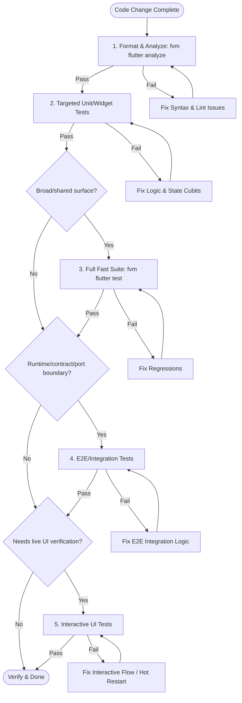

# Sanad Client Testing & Interactive Verification Protocol

This guide defines the unified interactive testing and verification protocol for `client`, designed to let AI agents verify interfaces, debug logic, and run integration tests inside isolated Git worktrees.

The CLI is platform-neutral, but it is not an accessibility crawler for arbitrary Flutter applications: the target Sanad Client must be launched through `client/lib/driver_main.dart` so the required Flutter Driver and Sanad service extensions are registered. `sanad-dev ui` owns desktop/worktree discovery. Mobile and web targets require a reachable explicit `--vm-url` (or `VM_SERVICE_URL`) and the same driver entry point.

---

## 1. Testing Methods & Priority Rules

### Non-Negotiable Testing Rules

* **Format & Analyze Single-Gate:** Do not run tests before verifying that static analysis and formatting pass for the files/surface being changed.
* **Scope-Based Automated Tests:** Run the focused unit/widget tests that cover the changed behavior. Run the full fast suite only for broad/shared-surface changes.
* **E2E By Scope Only:** Run E2E or integration tests only when the change affects real socket behavior, local daemon connection states, app/bootstrap runtime integration, worktree port/runtime isolation, client/daemon contracts, or another system boundary that mocks cannot validate.
* **Sequential Execution Only For Port-Binding Tests:** Use `--concurrency=1` only for E2E/integration tests that bind system ports or exclusive resources. Do not apply it to normal unit/widget/fast suites.
* **Clean Isolation:** Run Unit and Widget tests locally without launching external servers or the local daemon.
* **Desktop Interactive Last:** Launch the Interactive UI Testing Protocol only when static tests cannot validate the behavior or when visual/runtime verification is explicitly needed.

### Testing Priority Flowchart



### Bounded Verification Commands

Show only the final five lines of successful analyzer and test output while preserving the exit status through `pipefail`:

```bash
# Agent: full fast verification
set -o pipefail; (fvm dart analyze && fvm dart test) 2>&1 | tail -5

# Client: full fast verification
set -o pipefail; (fvm flutter analyze && fvm flutter test) 2>&1 | tail -5

# Focused Agent or E2E test
set -o pipefail; fvm dart test <path> 2>&1 | tail -5
set -o pipefail; fvm dart test <e2e-path> --concurrency=1 2>&1 | tail -5

# Focused Client test
set -o pipefail; fvm flutter test <path> 2>&1 | tail -5
```

If verification fails, rerun only the failing command without `tail` to inspect its complete output.

For managed runtimes, `sanad-dev logs` reads launcher-owned Agent/Client process journals, including pre-health/pre-VM output. Keep agent-issued reads bounded with `-n`; follow mode is human-terminal only. Manual runtime fallbacks are incomplete by design.

---


## 2. Agent Interactive UI Testing Protocol

To inspect the application's interface dynamically without rendering heavy external browsers, control the live desktop app directly via **Dart VM Service** using the permanent interactive test scripts.

### A. Workflow Steps

1. **Identify & Add Keys/IDs:** Inspect the target Flutter widget code. Ensure interactive elements have unique and descriptive `Key` objects (e.g., `key: const Key('chat_input')` or `key: const Key('send_message_btn')`).
2. **Run the Selected Runtime in Driver Mode:** From the current checkout/worktree root, launch the matched daemon/client pair:

    ```bash
    sanad-dev run --driver
    ```

   `sanad-dev` detects the checkout/worktree through Git, allocates its daemon and VM-service ports, assigns one worktree-scoped `SANAD_HOME` for all identity and mutable state when linked, isolates client preferences with the same home-derived boundary, passes the selected local gateway URL to Flutter, and records runtime metadata for later commands. Local and cloud connections are enabled by default; append `--no-cloud` only for explicit local-only verification.

3. **Inspect Runtime Status:** Confirm that the current worktree owns the expected processes and endpoints:

    ```bash
    sanad-dev status
    ```

4. **Inspect UI Structure:** From the repository root, prefer the worktree-scoped `sanad-dev` entry point. It resolves only the active driver-enabled client recorded for the current worktree:

    ```bash
    sanad-dev ui snapshot
    ```

   The standalone entry point requires an explicit package configuration and either `--vm-url` or `VM_SERVICE_URL`:

    ```bash
    fvm dart --packages=client/.dart_tool/package_config.json scripts/flutter_driver_cli.dart snapshot --vm-url <url>
    ```

   Use `--filter <query>` to search for specific elements or `--json` for machine parsing. For linked worktrees, confirm that `worktree_runtime_badge` is present and shows the current worktree directory name before performing actions.

5. **Interact with the Client Dynamically:** Execute driver actions command-by-command without writing custom Dart scripts:

    ```bash
    # Find widgets
    sanad-dev ui find --key chat_input
    sanad-dev ui find --text "Load more"

    # Tap elements (by key, text, index, or coordinates)
    sanad-dev ui tap --key send_message_btn
    sanad-dev ui tap --text "Load more" --index 0

    # Type text into input fields
    sanad-dev ui enter-text --key chat_input --text "Hello Sanad"

    # Scroll scrollable areas
    sanad-dev ui scroll --key device_workspace_sidebar_scroll --dy -300

    # Wait for elements to appear/disappear
    sanad-dev ui wait-for --key chat_input --timeout 10

    # Execute a declarative recipe JSON file
    sanad-dev ui batch --file client/test/interactive/sample_recipe.json
    ```

   Driver mode keeps Flutter's real operating-system text channel active so a
   human can type normally while automation is connected. `enter-text` uses the
   Sanad text-entry extension rather than globally enabling Flutter Driver's
   mocked text input. After automated entry, inspect the same keyed field and,
   when physical-input behavior changed, ask the human tester to type additional
   characters before closing the live gate.

6. **Visual Layout Verification (Optional):** Capture a screenshot only when layout evidence is needed or explicitly requested:

    ```bash
    sanad-dev ui screenshot --out client/test/interactive/screenshots/my_screen.png
    ```

7. **Clean Up Only a Runtime Launched for This Test:** Do not stop the active current-checkout daemon during live in-place self-development. When this procedure launched a disposable matched runtime, stop it from the same worktree:

    ```bash
    sanad-dev stop
    ```

### B. Permanent Interactive Test Tools

These general-purpose tools are permanently located in the workspace:

* **Unified UI CLI & Engine:** [flutter_driver_cli.dart](scripts/flutter_driver_cli.dart) and [flutter_driver_cli](scripts/flutter_driver_cli/) - Full suite for snapshotting, finding, tapping, typing, scrolling, waiting, screenshots, and batch recipes.
* **UI Crawler (Legacy):** [inspect_ui.dart](client/test/interactive/inspect_ui.dart) - Standalone legacy inspection script.
* **Screenshot Taker (Legacy):** [take_screenshot.dart](client/test/interactive/take_screenshot.dart) - Standalone legacy screenshot utility.
* **Interaction Template (Legacy):** [send_message_example.dart](client/test/interactive/send_message_example.dart) - Sample driver test script.

### C. Non-Negotiable Driver Rules

* **Missing Element Means Inspect the Widget First:** When `sanad-dev ui find` cannot locate an expected button, field, or other interactive element, inspect its Flutter widget source before trying coordinate-based interaction. If the widget has no unique descriptive `Key`, add one, run `sanad-dev reload client`, verify that the key is now discoverable, and then continue the interactive scenario through that key.
* **Never Abort mid-Driver Run:** Do not cancel a driver script while a tap or text entry operation is active to prevent the UI thread from hanging in a "Guarded" state.
* **Guarded Recovery:** If a `Guarded function conflict` occurs, immediately trigger a **Hot Restart** using the developer utility: `sanad-dev restart client` to reset the service.
* **Target Scaffolds over Slivers:** Tapping items inside `CustomScrollView` (Slivers) may hang on macOS. Target outer Scaffolds or static layouts first.
* **Unsynchronized Operations under Stream Activities:** Always wrap interactive driver actions (such as `tap` or `enterText`) inside `await driver.runUnsynchronized(() async { ... })` when testing fields or screens containing ongoing animations, thinking indicators, progress bars, or active thought streams. Failing to do so will cause the driver to hang indefinitely waiting for the application to reach an idle state.
* **No Hardcoded Machine Paths:** Do not hardcode absolute, machine-specific paths in driver interaction scripts for dynamic selector keys such as workspaces. Read paths dynamically or inject them through environment variables to preserve cross-platform compatibility.

---

## 3. Environment & Port Coordination (Git Worktree Isolation)

Before running any integration or interactive tests, verify that all backend services and the local daemon are active and their listening ports are properly synchronized.

### Git Worktree Isolation & Dynamic Runtime Allocation

**Critical Rule for Agents:** You must automatically detect if you are running inside a cloned **Git Worktree** instead of the main project root.

* **Why?** Parallel agent sessions running in different worktrees clash when they bind the same local gateway or Flutter VM service port, and they can corrupt or duplicate runtime work when they share writable session state.
* **The Solution:** Use `sanad-dev run` from the current checkout/worktree. Do not infer worktrees from directory naming, modify shared `.env`/JSON files, set `SANAD_STATE_HOME`, or hand-assign ports unless diagnosing the launcher itself. Linked worktrees receive one isolated `SANAD_HOME` containing identity, providers, credentials, databases, memories, dumps, and runtime state; the primary checkout retains the normal user home. Client preferences follow the same home-derived isolation boundary.

#### A. Standard Interactive Run

Use the canonical matched runtime for interactive verification:

```bash
sanad-dev run --driver
```

Local and cloud connections are enabled by default in both the primary checkout and linked worktrees, and public source runs select `client/config/prod.json`. The Dev profile is an explicit internal Backend/Portal integration choice. The launcher still isolates every linked worktree's ports, full Sanad Home, runtime metadata, complete component journals, and client preferences.

For deterministic local-only verification, disable cloud explicitly:

```bash
sanad-dev run --driver --no-cloud
```

#### B. Human Review and Connected Verification

For normal human review:

```bash
sanad-dev run
```

`--cloud` may be supplied to make the default connected behavior explicit. Avoid parallel cloud scenarios only when the scenario itself shares an external identity or other exclusive resource.

#### C. Manual Diagnostic Fallback

The unified launcher is canonical. Use direct component commands only while debugging the launcher itself or one process in isolation. Supply one absolute `SANAD_HOME`, remove any inherited `SANAD_STATE_HOME` with the current platform's environment mechanism, pass daemon and VM-service ports inline, and never edit tracked configuration files. Do not publish a single shell-specific command as the cross-platform equivalent of `sanad-dev`; Windows and POSIX environment syntax differ, while the launcher owns the portable implementation.

Keep manual diagnostic runs local-only unless the scenario explicitly requires cloud behavior. Normal matched and connected runs belong to `sanad-dev`.

---

### Reference Configuration Files

If manual editing is required for static configurations, consult these files:

1. **Unified Launcher:** [sanad_dev.dart](scripts/sanad_dev.dart) and the modules under [sanad_dev](scripts/sanad_dev/).
2. **Local Daemon:** [agent/.env.example](agent/.env.example) documents supported daemon variables; worktree runs inject overrides instead of editing it.
3. **Flutter Client:** [prod.json](client/config/prod.json) is the public source default while [dev.json](client/config/dev.json) is explicit internal integration; `sanad-dev` injects the selected local gateway URL.

---

## 4. Testing Connection Switching Scenario

Verify Sanad's transition between the local daemon gateway and cloud fallback without restarting the Flutter client. Cloud is enabled by default; treat this as an exclusive scenario only when the test shares an external account, hardware identity, or other resource that cannot be exercised safely in parallel.

### Configuration Target

Launch with `sanad-dev run --driver --cloud`. If the scenario requires toggling the daemon local gateway, use process-level overrides for `agent`; do not modify a tracked environment file.

* `ENABLE_LOCAL_GATEWAY=true` (Dual routing - Local Gateway takes priority).
* `ENABLE_LOCAL_GATEWAY=false` (Cloud fallback active).

### Test Workflow

1. **Phase 1 (Local Connection):**
    * Enable local gateway (`ENABLE_LOCAL_GATEWAY=true`) and start the daemon.
    * Verify the `local` badge is present next to the active agent name in the UI using `inspect_ui.dart`.
    * Send a message; confirm routing through the local gateway via the daemon log window.
2. **Phase 2 (Cloud Fallback Switching):**
    * Disable local gateway (`ENABLE_LOCAL_GATEWAY=false`) and restart only the daemon (do not touch the running Flutter app).
    * Verify the `local` badge disappears dynamically from the interface using `inspect_ui.dart`.
    * Send a message; confirm successful response rendering through the cloud gateway (`[sanad_gateway]`).

### Verification Indicators

| Check Point | Expected Output | Success Target |
| :--- | :--- | :--- |
| **Daemon Logs** | `execute_command: think` parsed by correct gateway | Routing verification |
| **Widget Inspection** | `inspect_ui.dart` lists updated threads and messages | UI message hydration |
| **UI Badge Hint** | Passive `local` text badge disappears dynamically | Auto-disconnect scope swap |
| **App Stability** | App UI remains fully responsive (no freezes/crashes) | Resilient connection continuity |

---

## 5. Best Practices & Rules for AI Agents

1. **Inspect Before Acting:** Always run `sanad-dev ui snapshot` first, verify the worktree badge and target keys, then execute UI actions. Use the legacy `inspect_ui.dart` only as a diagnostic fallback.
2. **Sequential Test Runs:** Only E2E or integration tests binding to system ports must run sequentially using `--concurrency=1` to prevent address collision.
3. **Scenario-Specific Test Integration (Promote Successful Tests):** When writing custom interactive scripts that successfully test a scenario, do not delete them. Promote them into automated integration tests inside the `integration_test/` directory to become part of the permanent CI/CD pipeline.
4. **Verification Double-Check:** Do not rely solely on daemon console output; programmatically check that the generated text or widgets appear in the UI layout.
5. **Clean & Purposeful Logs:** Maintain pristine log outputs in UI clients, daemons, and servers. Log only key lifecycle transitions and critical events. Avoid spamming standard output to save context window tokens and prevent diagnostic noise.
6. **Avoid Asynchronous Delays in Widget Tests (`testWidgets`):** Never use `await Future.delayed(...)` or `await Future<void>.delayed(Duration.zero)` inside a `testWidgets` test function. Under Flutter's widget test environment (which runs inside a fake clock `FakeAsync` zone), calling `Future.delayed` will suspend test execution indefinitely because the fake clock only advances when `tester.pump(...)` or `tester.pumpAndSettle()` is called. To let asynchronous streams, bloc state changes, or microtasks propagate, use `await tester.idle()` instead.

---

## 6. Multi-Question UI & Parsing Integration Guidelines

When developing, testing, or modifying multi-step execution suspension checkpoints (like the generalized `system.ask_user` tool supporting multiple step-by-step questions), follow these specific protocols:

* **JSON Payload Mapping Gotcha**: The websocket payload from the local daemon typically contains `questions` or fallback `question` at the root level of the event (e.g. `payload.questions`), rather than nested strictly inside `payload.tool_input`. The client model parsing layer (`AgentSuspendedRequest.fromJson`) MUST proactively map root-level `questions` / `question` fields into the `toolInput` map to ensure they are discovered by UI components and not silently skipped (which returns an empty questions list and hides the UI card).
* **Sequential Multi-Step Navigation Rules**:
  * The stateful interface (`_AgentInputPanelState`) displays exactly one question at a time.
  * Predefined options (exactly 3 per question) and custom text inputs (the 4th choice) must have deterministic dynamic `Key` structures (e.g. `const Key('ask_user_option_0_1')` for Question 0, Predefined Option 1, or `const Key('ask_user_custom_input')`).
  * Always verify that back navigation (`Key('ask_user_back_btn')`) updates `_currentQuestionIndex` and preserves state across transitions.
* **Hot Restart After Parsing Changes**: Any change made to the model representation layers (`AgentSuspendedRequest`, BLoC states, database schemas) will not be picked up by the VM service driver until a **Hot Restart** is triggered (e.g. by running `sanad-dev restart client`). Always trigger a hot restart before running dynamic UI crawler / interaction scripts.
