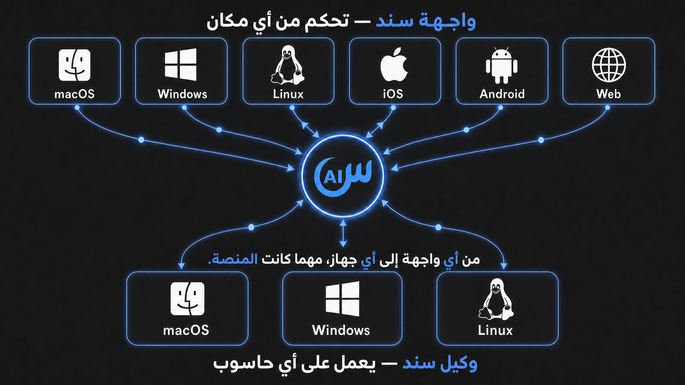

<div dir="rtl">

<p align="center">
  <picture>
    <source media="(prefers-color-scheme: dark)" srcset="client/assets/brand/sanad-wordmark-horizontal-dark.svg">
    <source media="(prefers-color-scheme: light)" srcset="client/assets/brand/sanad-wordmark-horizontal.svg">
    
  </picture>
</p>

<p align="center">
  <strong>وكيل ذكاء اصطناعي محلي أولًا ومتعدد المنصات لأجهزتك وخوادمك، تديره كلها من واجهة واحدة.</strong>
</p>

<p align="center">
  <a href="https://sanad.eaststarai.com"><strong>الموقع</strong></a>
  &nbsp;•&nbsp;
  <a href="https://app.sanad.eaststarai.com"><strong>تطبيق الويب</strong></a>
  &nbsp;•&nbsp;
  <a href="docs/product/features.md"><strong>المميزات</strong></a>
  &nbsp;•&nbsp;
  <a href="docs/operations/user_guide.md"><strong>دليل المستخدم</strong></a>
  &nbsp;•&nbsp;
  <a href="https://github.com/EastStarAI/sanad-agent/releases/latest"><strong>أحدث إصدار</strong></a>
  &nbsp;•&nbsp;
  <a href="https://github.com/EastStarAI/sanad-agent/actions/workflows/ci.yml"><strong>حالة البناء</strong></a>
  &nbsp;•&nbsp;
  <a href="LICENSE"><strong>الترخيص</strong></a>
  &nbsp;•&nbsp;
  <a href="https://github.com/EastStarAI/sanad-agent/discussions"><strong>المجتمع</strong></a>
  &nbsp;•&nbsp;
  <a href="README.md"><strong>English</strong></a>
</p>

يشغّل Sanad Agent وكيل Dart أصليًا بالقرب من ملفاتك وأدواتك. استخدمه محليًا
مع نماذج تعمل دون اتصال، أوثبّته على عدة أجهزة وخوادم دون واجهة رسومية وأدرها
من عميل Flutter واحد على سطح المكتب أوالهاتف أوالويب.

أنشأ **Ahmed Attia** مشروع Sanad Agent ويطوره تحت علامة **EastStar AI**، وهي
استوديو ذكاء اصطناعي مستقل.

<p align="center">
  
  <br>
  <em>تجربة Sanad واحدة على سطح المكتب والهاتف.</em>
</p>

<p align="center">
  
</p>

## لماذا Sanad؟

| القدرة | ما تمنحك إياه |
|---|---|
| **واجهة واحدة لكل أجهزتك** | اربط أجهزة سطح المكتب والخوادم، ثم تعامل مع مساحات عملها ومحادثاتها المستقلة من سطح المكتب أوالهاتف أوالويب. |
| **محلي أولًا، ويعمل دون اتصال** | صِل عميل سطح المكتب مباشرة بوكيل Dart. ومع Ollama أوLM Studio أوllama.cpp يمكن تشغيل المحادثات والأدوات المدعومة دون إنترنت. |
| **إعادة توجيه العمل الجاري** | وجّه الجولة النشطة عند الحد الآمن التالي دون إيقافها، أوضع طلبًا مستقلًا في الطابور. |
| **عمل متوازٍ يتعافى من الانقطاع** | شغّل محادثات معزولة بالتوازي واستعد حالة العمل النشط والمنتظر والمتوقف والفاشل والمكتمل بعد إعادة الاتصال أوتشغيل الوكيل. |
| **مزودوك وحساباتك** | اضبط مزودين مختلفين وعدة حسابات للمزود نفسه ونماذج محلية ونقاط نهاية مخصصة، وبدّل المسار داخل المحادثة مع failover مضبوط للنموذج نفسه. |
| **عزل كل مساحة عمل** | اعزل السياق والصلاحيات والمزود والمحادثات والمسودات وخوادم MCP والمهارات حسب مساحة العمل المالكة. |
| **ذاكرة وهوية قابلتان للفحص** | احفظ السياق طويل الأمد في ملفات وخصص الوكيل عبر `SOUL.md` و`USER.md` و`MEMORY.md` وتعليمات مساحة العمل. |
| **مهيأ للمساهمين ووكلاء البرمجة** | اتبع عقود `AGENTS.md` المتدرجة وفهرس التوثيق، واستخدم تشغيلات `sanad-dev` المعزولة والسجلات وإعادة التشغيل المنضبطة وFlutter hot reload. |

اطلع على القدرات والقيود الحالية كاملة في
[مميزات Sanad Agent](docs/product/features.md).

## البدء السريع

هل تستخدم وكيل ذكاء اصطناعي؟ أعطه رابط
[مهارة تثبيت Sanad](.agents/skills/install-sanad/SKILL.md) ليفحص جهازك، ويشرح
لك مساري المستخدم والمطور، وينفذ المسار الذي تختاره بأمان. بعد ذلك، دع Sanad
يتولى الباقي.

### للمستخدمين

#### نزّل واجهة Sanad Client

<p align="center">
  <a href="https://downloads.sanad.eaststarai.com/client/macos"></a>
  <a href="https://downloads.sanad.eaststarai.com/client/windows"></a>
  <a href="https://downloads.sanad.eaststarai.com/client/linux"></a>
</p>

1. نزّل Sanad Client لمنصة سطح المكتب وافتحه.
2. اختر **Run Locally**. تنزّل الواجهة نسخة Sanad Agent المطابقة وتتحقق منها
   وتثبتها وتشغلها تلقائيًا؛ لا تحتاج إلى تنزيل Agent منفصلًا.
3. أضف مزود نماذج محليًا أو مستضافًا، واختر مساحة عمل، وابدأ العمل.

لا يلزم حساب Sanad أو pairing token لهذا المسار المحلي. على الهاتف، استخدم
[Web Client](https://app.sanad.eaststarai.com) حتى تتوفر إصدارات Android وiOS
المستقرة للعامة.

> **بناء Windows غير موقّع:** إصدار Windows الحالي غير موقّع. نزّله فقط من
> الزر الرسمي أعلاه واتبع إرشادات التحقق في
> [دليل تثبيت واستخدام Sanad Agent](docs/operations/user_guide.md).

#### صِل جهازًا آخر أو خادمًا بعيدًا

يحتاج الجهاز البعيد إلى Sanad Agent فقط؛ استمر في استخدام Sanad Client على
سطح المكتب أو الهاتف أو الويب.

1. افتح Sanad Client على سطح المكتب أو الهاتف أو الويب.
2. افتح **Device Management**، واختر **Add device**، ثم سمِّ الجهاز.
3. انسخ الأمر الكامل الذي تولده الواجهة وشغّله مرة واحدة على الجهاز أو الخادم
   الهدف.
4. ارجع إلى الواجهة، واختر الجهاز المتصل، وابدأ العمل مع مساحات عمله
   ومحادثاته.

يتضمن الأمر المولّد اعتماد pairing مؤقتًا وصالحًا لإنشاء الجهاز مرة واحدة.
لا تنشئ هذا الاعتماد أو تلصقه أو تشاركه بصورة منفصلة. عند أول اتصال ناجح
يستبدله الوكيل باعتماد دائم للجهاز يولَّد محليًا.

أو يمكنك تثبيت الوكيل مباشرة، ثم اختيار تسجيل الدخول إلى الحساب أو التشغيل
المحلي. على macOS أو Linux:

```bash
curl -fsSL https://sanad.eaststarai.com/install.sh | bash
```

على Windows PowerShell:

```powershell
& ([scriptblock]::Create((irm https://sanad.eaststarai.com/install.ps1)))
```

اختر تسجيل الدخول لربط الجهاز من خلال Portal، أو تخطَّه لتشغيل الوكيل محليًا
وربطه لاحقًا. لا ينتظر المُثبّت إجابة عند تشغيله في طرفية غير تفاعلية.

> **بناء Windows غير موقّع:** مثبّت Windows في الإصدار `1.0.1` غير موقّع
> عمدًا. تحقق أنه من الإصدار الرسمي وأن SHA-256 يطابق release manifest المنشور
> قبل المتابعة. لا تعطّل Microsoft Defender أوSmart App Control. تُنفذ بوابات
> إصدار Windows على Windows 11؛ ولم يُتحقق من Windows 10.

راجع [دليل تثبيت واستخدام Sanad Agent](docs/operations/user_guide.md) لحزم
العميل، وخيارات المُثبّت الصريحة، والتثبيت اليدوي، وإدارة الخدمة، والمزودين،
والتحديث، والإزالة.

### للمطورين

> **المتطلبات الأساسية:** تأكد من تثبيت أدوات التطوير الخاصة بنظام تشغيلك قبل الإعداد:
> - **Windows:** برنامج Visual Studio 2022 مع حزمة *Desktop development with C++*.
> - **macOS:** أدوات Xcode الخطية (`xcode-select --install`).
> - **Linux:** حزم `clang`, `cmake`, `ninja-build`, `pkg-config`, `libgtk-3-dev`, `lld`.
>
> راجع [دليل المطور](docs/operations/developer_guide.md) للتفاصيل والإعداد الكامل.

استنسخ المستودع وانتقل إلى مجلده:

```bash
git clone https://github.com/EastStarAI/sanad-agent.git sanad-agent
cd sanad-agent
```

ثبّت أمر التطوير ضمن حساب المستخدم مرة واحدة. على macOS أوLinux:

```bash
scripts/sanad-dev install
```

وعلى Windows PowerShell:

```powershell
.\scripts\sanad-dev.ps1 install
```

بعد ذلك استخدم أمر التشغيل الرسمي للمصدر على جميع المنصات:

```bash
sanad-dev run
```

يثبّت `run` الأدوات المعتمدة الناقصة، ويحل اعتماديات Release Contract والوكيل
والواجهة عند تقادمها، ثم يشغّل الزوج المُدار كاملًا. تعرض مرحلتا التثبيت
والتجهيز المخرجات الحقيقية للعمليات ولا تحتاجان إلى صلاحيات المسؤول.

مسار التطوير من المصدر مستقل عن مُثبّت الإصدار الموضح أعلاه ولا يحتاج إلى
pairing token.

لاختيار جهاز Flutter أوالتشغيل محليًا دون اتصال سحابي أوالاطلاع على أوامر
التطوير والاختبار، راجع [دليل المطور](docs/operations/developer_guide.md).

## اختر طريقة عملك

| الوضع | مكان تشغيل الوكيل | مكان التحكم | حساب Sanad |
|---|---|---|---|
| سطح مكتب محلي | جهاز macOS أوLinux أوWindows نفسه | عميل سطح المكتب عبر اتصال محلي مباشر | غير مطلوب |
| جهاز متصل | جهاز مكتبي أوبعيد مربوط | سطح المكتب أوالهاتف أوالويب | مطلوب |
| خادم headless | خادم macOS أوLinux أوWindows مربوط | سطح المكتب أوالهاتف أوالويب | مطلوب |
| CLI مستقل | الجهاز أوالخادم الحالي | الطرفية | غير مطلوب محليًا؛ مطلوب للوصول المتصل |

## كيف يعمل؟

```text
Flutter Client
├── اتصال محلي مباشر ─────────► Dart Agent على هذا الجهاز
└── اتصال مستضاف اختياري ─────► Sanad Gateway ─────► Dart Agent على جهاز بعيد

Dart Agent
├── مساحات العمل والجلسات والتعافي والذاكرة وإعداد المزودين
├── الأدوات المدمجة وخوادم MCP والمهارات وتطبيق الصلاحيات
└── اتصال بنموذج محلي أومزود نماذج خارجي
```

يملك وكيل Dart التنفيذ والحالة المحلية. ويوفر عميل Flutter واجهة اختيار الأجهزة
ومساحات العمل والمحادثات والمزودين والنماذج، وعرض الرسائل والأدوات والصلاحيات
والأسئلة والطوابير وحالة التعافي.

## بنية المستودع

- [`agent/`](agent/) — CLI وخدمة خلفية أصليان بـDart يملكان التنفيذ والحالة المحلية.
- [`client/`](client/) — واجهة Flutter للأجهزة المحلية والبعيدة.
- [`docs/`](docs/) — توثيق المنتج والتقنية والتشغيل والجودة.
- [`scripts/`](scripts/) — أدوات التطوير والتوثيق والبناء والإصدار.

## التفاعلات الأساسية

### وجّه الوكيل أثناء العمل

أرسل رسالة عادية أثناء الجولة النشطة لتوجيهها عند الحد الآمن التالي دون فقدان
تقدمها. استخدم `Ctrl+Enter` على Windows/Linux أو`Cmd+Enter` على macOS لوضع طلب
مستقل في الطابور. يمكن ترقية الطلبات أوحذفها، ويعيد Stop المدخلات غير المنفذة
إلى المسودة.

### دع الوكيل يسأل

يمكن للوكيل تعليق الجولة وعرض بطاقة سؤال بإجابات مقترحة وخيار إجابة مخصصة، ثم
يستأنف الجولة نفسها بعد إجابتك. طلبات الصلاحية منفصلة وتبقى خاضعة لسياسة مساحة
العمل.

### استخدم عدة مزودين وحسابات

أنشئ عدة instances من المزود نفسه، مثل حساب شخصي وآخر للعمل. لكل instance
اعتماداته ونموذجه وجاهزيته وحدوده وسياسة failover مستقلة. ويمكن لـChatGPT
Subscription عرض نافذتي الاستهلاك Session وWeekly المعتمدتين.

### موارد مستقلة للمزودين

يمكنك استخدام Sanad مع مزودين محليين أو مستضافين، وإضافة عدة حسابات للمزود
نفسه.

- [Free LLM API Resources](https://github.com/cheahjs/free-llm-api-resources) —
  دليل مجتمعي لخدمات LLM التي توفر خططًا مجانية أو أرصدة تجريبية.

هذا مورد خارجي مستقل وغير تابع لـSanad. قد تتغير النماذج والحصص والأسعار
وسياسات الخصوصية وشروط الاستخدام؛ راجع شروط كل مزود قبل إرسال بيانات مساحة
العمل.

### وسّعه عبر MCP والمهارات

صِل خوادم MCP عبر stdio أوServer-Sent Events أوstreamable HTTP، وثبّت المهارات
على مستوى المستخدم أومساحة العمل. تتقدم تعريفات مساحة العمل على القدرات العامة
ذات الاسم نفسه.

## المنصات

| المكوّن | المنصات |
|---|---|
| Sanad Agent | macOS وLinux وWindows، بما في ذلك التشغيل headless |
| Sanad Client | macOS وWindows وLinux وAndroid وiOS عبر Internal TestFlight في الإصدار الأول، والويب |

## حالة المميزات والقيود

- **الجدولة:** تستمر المهام one-shot المحفوظة ما دامت خدمة الوكيل نشطة؛ لا تدخل
  جداول cron المتكررة في السطح المستقر.
- **Computer Use:** تحتاج أدوات لقطة الشاشة ولوحة المفاتيح والفأرة إلى تفعيل
  صريح وصلاحيات نظام التشغيل المناسبة.
- **الصوت المباشر:** مسار Gemini Realtime تجريبي ومخفي افتراضيًا وليس من
  المميزات المستقرة. راجع [الصوت المباشر التجريبي](docs/technical/voice_streaming.md).
- **السعة:** لا يفرض Sanad عددًا ثابتًا للمحادثات أوprovider instances؛ تعتمد
  السعة العملية على الجهاز والمزودين.

## التوثيق

| الدليل | المحتوى |
|---|---|
| [المميزات](docs/product/features.md) | القدرات والقيود والحدود التجريبية |
| [دليل المستخدم](docs/operations/user_guide.md) | التثبيت والربط والمزودون والتحديث وإدارة الخدمة والإزالة |
| [دليل المطور](docs/operations/developer_guide.md) | إعداد المصدر والاختبارات وworktrees والسجلات وإعادة التشغيل |
| [واجهة العميل](docs/product/client_interface.md) | الأجهزة ومساحات العمل والمحادثات والمزودون والصلاحيات |
| [بروتوكول المزودين](docs/technical/provider_protocol.md) | القوالب والinstances والاعتمادات والنماذج والجاهزية والاستهلاك وfailover |
| [الاتصال المستضاف](docs/technical/hosted_services_boundary.md) | الهوية والأجهزة والrelay وملكية الحالة |
| [التوثيق التقني](docs/technical/MOC.md) | تشغيل agent/client والبروتوكولات والتخزين والمنصات |
| [محرك الوكيل](docs/agent_engine/MOC.md) | تنفيذ النماذج والأدوات وMCP والمهارات والقدرات |
| [الجودة والتعافي](docs/qa_maintenance/MOC.md) | مصفوفات الانحدار وسلوك التعافي |
| [الفهرس المقروء آليًا](docs/llms.txt) | مداخل التوثيق المنسقة للمطورين ووكلاء البرمجة |

## الأمان والخصوصية

تعود ملكية مساحات العمل والمحادثات وإعداد المزودين والذكريات وحالة التنفيذ إلى
الوكيل العامل على الجهاز المختار. تتبادل مميزات الأجهزة المتصلة الهوية وقائمة
الأجهزة والأوامر والأحداث اللازمة لتشغيل relay البعيد.

لا تضع API keys أوtokens في Git. اعتمادات المزود وهوية Sanad بيانات تشغيل
خارج Git، وتُنقح الحقول الشبيهة بالاعتمادات عند إنتاج diagnostics.

أبلغ عن الثغرات بصورة خاصة وفق [SECURITY.md](SECURITY.md).

## المساهمة

نرحب بالمساهمات. ابدأ من [CONTRIBUTING.md](CONTRIBUTING.md)، واتبع أقرب عقد
`AGENTS.md`، واقرأ [CODE_OF_CONDUCT.md](.github/CODE_OF_CONDUCT.md). لا تتطلب
المساهمة CLA أوDCO؛ تلزم الفحوص وprotected review labels، وتستخدم PRs البشرية
Squash Merge.

## المجتمع

- **Issues:** [أبلغ عن bug أواقترح عملًا قابلًا للتنفيذ](https://github.com/EastStarAI/sanad-agent/issues)
- **Discussions:** [اقترح فكرة أواطرح سؤالًا معماريًا](https://github.com/EastStarAI/sanad-agent/discussions)
- **المجتمع:** [انضم إلى خادم Sanad Agent على Discord](https://discord.gg/RPTJ2X9rn)
  (دعوة دائمة مملوكة للمشروع، تهبط في `#help-and-support`).
- **الدعم:** [اختر قناة المساعدة الصحيحة](.github/SUPPORT.md)
- **الحوكمة:** [اقرأ آلية القرارات والمساهمات](.github/GOVERNANCE.md)
- **الأمان:** [أبلغ عن الثغرات بصورة خاصة](SECURITY.md)
- **توقيع الكود:** [راجع سياسة الثقة والتوقيع للملفات المنشورة](docs/operations/code_signing_policy.md)

## الترخيص

يتوفر Sanad Agent تحت [ترخيص MIT](LICENSE).

Copyright © 2026 Ahmed Attia, operating as EastStar AI.

</div>
