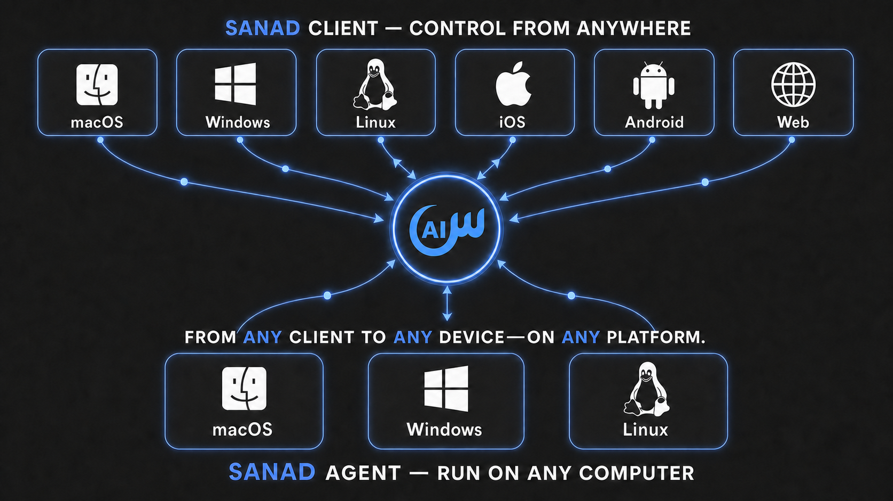

<p align="center">
  <picture>
    <source media="(prefers-color-scheme: dark)" srcset="client/assets/brand/sanad-wordmark-horizontal-dark.svg">
    <source media="(prefers-color-scheme: light)" srcset="client/assets/brand/sanad-wordmark-horizontal.svg">
    
  </picture>
</p>

<p align="center">
  <strong>A local-first, cross-platform AI agent for your computers and servers—all managed from one interface.</strong>
</p>

<p align="center">
  <a href="https://sanad.eaststarai.com"></a>
  <a href="https://app.sanad.eaststarai.com"></a>
  <a href="docs/product/features.md"></a>
  <a href="docs/operations/user_guide.md"></a>
  <a href="https://github.com/EastStarAI/sanad-agent/releases/latest"></a>
  <a href="https://github.com/EastStarAI/sanad-agent/actions/workflows/ci.yml"></a>
  <a href="LICENSE"></a>
  <a href="https://github.com/EastStarAI/sanad-agent/discussions"></a>
  <a href="README.ar.md"></a>
</p>

Sanad Agent runs a native Dart agent close to your files and tools. Use it
locally with offline models, or install it on multiple computers and headless
servers and manage them from the same Flutter client on desktop, mobile, or
the web.

Sanad Agent is created by **Ahmed Attia** and developed under **EastStar AI**,
an independent AI studio.

<p align="center">
  
  <br>
  <em>One Sanad experience across desktop and mobile.</em>
</p>

<p align="center">
  
</p>

## Why Sanad

| Capability | What it gives you |
|---|---|
| **One interface for every device** | Pair desktop computers and headless servers, then work with their independent workspaces and conversations from desktop, mobile, or web. |
| **Local-first, including offline use** | Connect the desktop client directly to the native Dart agent. With Ollama, LM Studio, or llama.cpp, supported conversations and tools can run without an internet connection. |
| **Redirect work in progress** | Steer an active run at the next safe boundary without stopping it, or queue separate work behind it. |
| **Parallel work that survives disruption** | Run isolated conversations concurrently and reconstruct running, queued, waiting, failed, and completed work after reconnect or agent restart. |
| **Bring your providers and accounts** | Configure different providers, multiple accounts for the same provider, local runtimes, and custom endpoints; switch routes inside a conversation and use eligible exact-model failover. |
| **Keep every workspace isolated** | Scope context, permissions, provider choice, conversations, drafts, MCP servers, and skills to the workspace that owns them. |
| **Memory and identity you can inspect** | Preserve long-term context in files and customize the agent with `SOUL.md`, `USER.md`, `MEMORY.md`, and workspace instructions. |
| **Built for contributors and coding agents** | Follow layered `AGENTS.md` Runtime Contracts and a curated documentation index; use isolated `sanad-dev` runtimes, live logs, supervised agent restart, and Flutter hot reload. |

Explore the complete capability set and its current boundaries in
[Sanad Agent Features](docs/product/features.md).

## Quick start

Using an AI agent? Share the
[Install Sanad skill](.agents/skills/install-sanad/SKILL.md) with it so it can
inspect your machine, explain the release-user and source-developer paths, and
safely carry out the path you choose. Then let Sanad handle the rest.

### For users

#### Download Sanad Client

<p align="center">
  <a href="https://downloads.sanad.eaststarai.com/client/macos"></a>
  <a href="https://downloads.sanad.eaststarai.com/client/windows"></a>
  <a href="https://downloads.sanad.eaststarai.com/client/linux"></a>
</p>

1. Download and launch Sanad Client for your desktop platform.
2. Choose **Run Locally**. The Client downloads, verifies, installs, and starts
   the matching Sanad Agent automatically; you do not download Agent separately.
3. Add a local or hosted model provider, select a workspace, and start working.

A Sanad account and pairing token are not required for this local-only path.
On mobile, use the [Web Client](https://app.sanad.eaststarai.com) until stable
Android and iOS apps are publicly available.

> **Unsigned Windows build:** The current Windows release is unsigned. Download it
> only through the official button above and follow the verification guidance in
> [Install and Use Sanad Agent](docs/operations/user_guide.md).

#### Connect another computer or a server

Only Sanad Agent needs to be installed on the remote machine. Keep using Sanad
Client on your desktop, phone, or the web.

1. Open Sanad Client on desktop, mobile, or the web.
2. Open **Device Management**, choose **Add device**, and name the device.
3. Copy the complete command generated by the Client and run it once on the
   target computer or headless server.
4. Return to the Client, select the connected device, and begin working with
   its workspaces and conversations.

The generated command contains a short-lived, creation-only pairing credential.
Do not construct, paste, or share that credential separately. On the first
successful connection, the Agent replaces it with a durable device credential
generated locally.

Alternatively, install the Agent directly, then choose account sign-in or
local-only mode. For macOS or Linux:

```bash
curl -fsSL https://sanad.eaststarai.com/install.sh | bash
```

For Windows PowerShell:

```powershell
& ([scriptblock]::Create((irm https://sanad.eaststarai.com/install.ps1)))
```

Choose account sign-in to connect the machine through the Portal, or skip it
to run the Agent locally and connect later. The installer never blocks an
unattended terminal waiting for an answer.

> **Unsigned Windows build:** The `1.0.1` Windows installer is intentionally
> unsigned. Verify that it came from the official release and that its SHA-256
> matches the published release manifest before proceeding. Do not disable
> Microsoft Defender or Smart App Control. Windows release gates run on
> Windows 11; Windows 10 has not been validated.

See [Install and Use Sanad Agent](docs/operations/user_guide.md) for client
packages, explicit installer modes, manual installation, service management,
providers, updates, and removal.

### For developers

> **Prerequisites:** Ensure your system has the build toolchain for your platform:
> - **Windows:** Visual Studio 2022 with *Desktop development with C++*.
> - **macOS:** Xcode Command Line Tools (`xcode-select --install`).
> - **Linux:** `clang`, `cmake`, `ninja-build`, `pkg-config`, `libgtk-3-dev`, `lld`.
>
> See the [Developer Guide](docs/operations/developer_guide.md) for full prerequisites and details.

Clone the repository and enter its directory:

```bash
git clone https://github.com/EastStarAI/sanad-agent.git sanad-agent
cd sanad-agent
```

Install the user-scoped development command once. On macOS or Linux:

```bash
scripts/sanad-dev install
```

On Windows PowerShell:

```powershell
.\scripts\sanad-dev.ps1 install
```

Then use the official source run command on every platform:

```bash
sanad-dev run
```

`run` installs any missing pinned tools, resolves the shared Release Contract,
Agent, and Client dependencies when stale, then starts the complete managed
pair. Installation and setup stream their real process output and require no
administrator access.

This source-development path is independent from the release installer above
and does not require a pairing token.

For Flutter device selection, local-only operation, development commands, and
testing workflows, follow the
[Developer Guide](docs/operations/developer_guide.md).

## Choose how you work

| Mode | Where the agent runs | Where you control it | Sanad account |
|---|---|---|---|
| Local desktop | The same macOS, Linux, or Windows computer | Desktop client through a direct local connection | Not required |
| Connected computer | A paired desktop or remote computer | Desktop, mobile, or web client | Required |
| Headless server | A paired macOS, Linux, or Windows server | Desktop, mobile, or web client | Required |
| Standalone CLI | The current computer or server | Terminal | Not required locally; required for connected-device access |

## How it works

```text
Flutter Client
├── Direct local connection ─────────► Dart Agent on this computer
└── Optional hosted connection ──────► Sanad Gateway ─────► Dart Agent on a remote device

Dart Agent
├── Workspaces, sessions, recovery, memory, and provider configuration
├── Built-in tools, MCP servers, skills, and permission enforcement
└── Local model or external model-provider connection
```

The Dart agent owns execution and local state. The Flutter client provides the
interface for selecting devices, workspaces, conversations, providers, and
models while rendering messages, tools, permissions, questions, queues, and
recovery state.

## Repository structure

- [`agent/`](agent/) — native Dart CLI and background service that owns
  execution and local state.
- [`client/`](client/) — Flutter interface for local and remote devices.
- [`docs/`](docs/) — product, technical, operations, and QA documentation.
- [`scripts/`](scripts/) — development, documentation, build, and release
  tooling.

## Key interactions

### Steer while the agent works

Send a normal message during an active run to redirect it at the next safe
boundary without discarding its progress. Use `Ctrl+Enter` on Windows/Linux or
`Cmd+Enter` on macOS to queue a separate request instead. Queued work can be
promoted to steering or removed, and Stop restores unexecuted input to the
draft.

### Let the agent ask

The agent can suspend a turn and show a question card with suggested answers
and a custom-response option. Your answer resumes the same turn. Permission
requests use a separate inline card and remain governed by workspace policy.

### Use multiple providers and accounts

Create multiple instances of one provider—for example, separate personal and
work accounts. Each instance has independent credentials, model, readiness,
rate limits, and failover policy. ChatGPT Subscription instances can also show
their authoritative Session and Weekly usage windows.

### Independent provider resources

Sanad can work with local or hosted providers and multiple accounts for the
same provider.

- [Free LLM API Resources](https://github.com/nejib1/Free-LLM) —
  a community-maintained directory of LLM services offering free tiers or
  trial credits.

This is an independent third-party resource and is not affiliated with Sanad.
Models, quotas, prices, privacy practices, and usage terms may change; review
each provider's terms before sending workspace data.

### Extend it with MCP and skills

Connect MCP servers over stdio, Server-Sent Events, or streamable HTTP, and
install skills globally for the user or locally for a workspace. Workspace
definitions take priority over user-level capabilities with the same name.

## Platforms

| Component | Platforms |
|---|---|
| Sanad Agent | macOS, Linux, and Windows, including headless operation |
| Sanad Client | macOS, Windows, Linux, Android, iOS (Internal TestFlight for the first release), and Web |

## Feature status and constraints

- **Scheduling:** persisted one-shot tasks can run while the agent service
  remains active. Recurring cron-style schedules are not part of the stable
  scheduling surface.
- **Computer use:** desktop screenshot, keyboard, and mouse tools require
  explicit enablement and the corresponding operating-system permissions.
- **Realtime voice:** the Gemini Realtime voice path is experimental, hidden
  by default, and not part of the stable feature set. See
  [Experimental Realtime Voice](docs/technical/voice_streaming.md).
- **Capacity:** Sanad does not impose a fixed product count on conversations
  or provider instances; practical capacity depends on the device and the
  connected providers.

## Documentation

| Guide | What it covers |
|---|---|
| [Features](docs/product/features.md) | Complete user-facing capabilities, constraints, and experimental boundaries |
| [Installation and User Guide](docs/operations/user_guide.md) | Client and agent installation, device pairing, providers, updates, service management, and removal |
| [Developer Guide](docs/operations/developer_guide.md) | Source setup, tests, isolated worktrees, logs, restart controls, and Flutter reload |
| [Client Interface](docs/product/client_interface.md) | Devices, workspaces, conversations, steering, queues, questions, permissions, providers, and responsive behavior |
| [Provider Protocol](docs/technical/provider_protocol.md) | Provider templates, instances, credentials, models, readiness, usage, and failover |
| [Hosted Connectivity](docs/technical/hosted_services_boundary.md) | Identity, device inventory, remote relay, and the state that remains owned by the selected agent |
| [Technical Documentation](docs/technical/MOC.md) | Agent/client runtime, protocols, persistence, platform integration, and hosted connectivity |
| [Agent Engine](docs/agent_engine/MOC.md) | Model execution, tools, MCP, skills, prompts, and capability contracts |
| [QA and Recovery](docs/qa_maintenance/MOC.md) | Regression matrices and recovery behavior |
| [Machine-readable Index](docs/llms.txt) | Curated documentation entry points for developers and coding agents |

## Security and privacy

Local workspaces, conversations, provider configuration, memories, and
execution state are owned by the agent running on the selected device.
Connected-device features exchange the identity, device inventory, commands,
and events necessary to operate the remote relay.

Never commit API keys or tokens. Provider credentials and Sanad identity
tokens are runtime user data outside Git, and diagnostic serialization redacts
credential-shaped fields.

Report vulnerabilities privately according to [SECURITY.md](SECURITY.md).

## Contributing

Contributions are welcome. Start with [CONTRIBUTING.md](CONTRIBUTING.md),
follow the nearest `AGENTS.md` Runtime Contract, and read
[CODE_OF_CONDUCT.md](.github/CODE_OF_CONDUCT.md). Contributions require no CLA or DCO;
required checks and protected review labels apply, and human pull requests use
squash merge.

## Community

- **Issues:** [Report a bug or request actionable work](https://github.com/EastStarAI/sanad-agent/issues)
- **Discussions:** [Propose an idea or ask an architectural question](https://github.com/EastStarAI/sanad-agent/discussions)
- **Community:** [Join the Sanad Agent Discord](https://discord.gg/RPTJ2X9rn)
  (permanent project invite, lands in `#help-and-support`).
- **Support:** [Choose the correct help channel](.github/SUPPORT.md)
- **Governance:** [Read how decisions and contributions work](.github/GOVERNANCE.md)
- **Security:** [Report vulnerabilities privately](SECURITY.md)
- **Code signing:** [Review artifact trust and signing policy](docs/operations/code_signing_policy.md)

## License

Sanad Agent is available under the [MIT License](LICENSE).

Copyright © 2026 Ahmed Attia, operating as EastStar AI.
