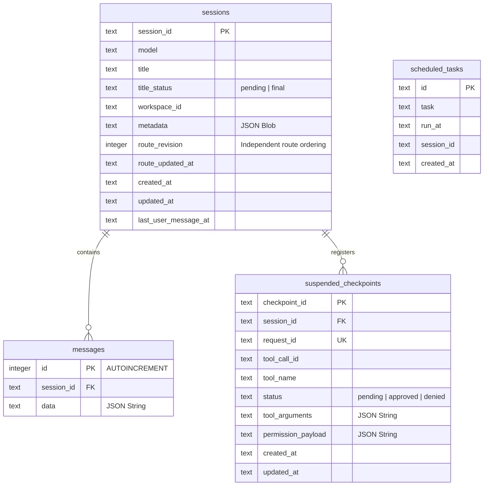

# مواصفات قاعدة البيانات المحلية للوكيل | Local Agent Database Schema Specification

This document provides a technical specification of the local SQLite database (`state.db`) managed dynamically by the `sanad-agent` Dart daemon on the user's host machine.

Hosted gateway services may use their own server-side persistence, which is outside this repository. This page documents only the local SQLite state owned by the open-source agent.

---

## 1. Local Database Storage Path
To ensure complete user privacy and offline functionality, all conversation logs, local workspace mapping, provider instance metadata, and logical agent settings are saved directly on the host machine.

### `state.db` — Single Agent State Database (All tables)
- **Default macOS/Linux:** `$HOME/.sanad/state.db` (usually `~/.sanad/state.db`)
- **Default Windows:** `%USERPROFILE%\.sanad\state.db`
- **Isolated `sanad-dev` runtime:** `$SANAD_HOME/state.db`. Each linked Git worktree receives one distinct Sanad Home containing both runtime state and identity/provider configuration; the primary checkout uses the ordinary home. External test harnesses may still redirect only state through `SANAD_STATE_HOME`.

`state.db` is owned by a single [AgentStateDatabase](../../agent/lib/evolution/db/agent_state_database.dart) connection (registered as a lazy singleton in DI). It enables `PRAGMA foreign_keys = ON` and creates **all** schema — sessions, messages, scheduled tasks, suspended checkpoints, **and** the Plan 29 provider tables (`provider_instances`, `provider_model_cache`, `recent_model_selections`). `SessionDB` and `ProviderInstanceRepository` share this one connection and never open `state.db` a second time. There is no `providers.db`.

When constructed without an injected `SessionManager`, suspended-checkpoint and resume collaborators acquire one only when a persistence or resume operation first needs session state. Constructing an unused standalone collaborator, including a test double that overrides its persistence methods, does not open or migrate `state.db`; production DI continues to inject the shared manager explicitly.

Plan 29 provider tables hold **no secrets**; API keys and OAuth tokens live only in the `SecretStore` (`provider_secrets.json`), keyed by instance UUID.

---

## 2. SQLite Entity-Relationship Diagram



---

## 3. Table Specifications

### 3.1. `sessions` Table
Stores active and historical chat threads/sessions configured locally for the device.

| Column | Type | Constraints | Description |
|---|---|---|---|
| `session_id` | `TEXT` | Primary Key | UUID identifying the chat thread |
| `model` | `TEXT` | Non-null | Active LLM model selected for the session |
| `title` | `TEXT` | Nullable | User-friendly conversation title or automatic first-message placeholder |
| `title_status` | `TEXT` | Non-null, default `final`, checked `pending \| final` | Durable ownership state: only `pending` titles may be replaced by background/startup generation; migration defaults existing rows to `final` |
| `workspace_id` | `TEXT` | Nullable | Stable UUID referencing the logical workspace identity; never a filesystem path |
| `metadata` | `TEXT` | Nullable | JSON string storing metrics and run stats |
| `route_revision` | `INTEGER` | Non-null, default `1` | Monotonic ordering for provider/model route mutations; independent from execution revision |
| `route_updated_at` | `TEXT` | Nullable only during legacy migration | ISO8601 timestamp of the current durable route revision |
| `created_at` | `TEXT` | Non-null | ISO8601 creation date string |
| `updated_at` | `TEXT` | Non-null | ISO8601 update date string |
| `last_user_message_at` | `TEXT` | Non-null after migration backfill | Canonical ordering timestamp used by `get_sessions` keyset pagination |

#### Session Title Ownership

- New automatic first-message snippets use `title_status = pending`; an explicit client title uses `final` immediately.
- Intelligent generation and startup recovery update `title` only when both the captured title and `pending` status still match, then atomically set `title_status = final`.
- Manual rename always sets `final`, so delayed background work cannot overwrite it. Legacy rows are migrated to `final` to avoid reinterpreting existing user titles as placeholders.

#### Session Ordering and Pagination Notes

- `last_user_message_at` is stored in normalized UTC ISO8601 format and is the authoritative primary sort key for session list queries.
- The daemon updates `last_user_message_at` only when a canonical user message or steer is accepted. Assistant/tool/system persistence must not mutate session ordering.
- Blank `workspace_id` values are normalized to `NULL` so `unscoped_only` queries can use a stable `workspace_id IS NULL` filter.
- `saveSession` uses `created_at` as the fallback only on the initial INSERT path. Later UPSERTs that omit `last_user_message_at` must preserve the stored ordering value instead of resetting it.
- Migration/backfill of `last_user_message_at` is idempotent and batched: only dirty rows are rewritten, and large legacy sets must not exceed SQLite variable limits.
- `AgentStateDatabase` now maintains the indices `idx_sessions_ordering`, `idx_sessions_workspace_ordering`, and `idx_messages_session_id` to support session pagination and migration backfill efficiently.

### 3.2. `messages` Table
Maintains message history. Messages are serialized as JSON blobs in the `data` column to support flexible metadata and nested tool parameters.

| Column | Type | Constraints | Description |
|---|---|---|---|
| `id` | `INTEGER` | Primary Key, Autoincrement | Sequence tracker |
| `session_id` | `TEXT` | Foreign Key (`sessions.session_id`), ON DELETE CASCADE | Associated chat thread |
| `data` | `TEXT` | Non-null | JSON string mapping to the protocol `Message` |

### 3.3. `scheduled_tasks` Table
Tracks automation tasks and scheduled loops that the daemon runs asynchronously.

| Column | Type | Constraints | Description |
|---|---|---|---|
| `id` | `TEXT` | Primary Key | Unique task identifier |
| `task` | `TEXT` | Non-null | Task details or command payload |
| `run_at` | `TEXT` | Non-null | ISO8601 scheduled execution time |
| `session_id` | `TEXT` | Non-null | Originating conversation thread |
| `created_at` | `TEXT` | Non-null | ISO8601 creation timestamp |

### 3.4. `suspended_checkpoints` Table
Persists agent execution states when suspended for manual user approvals or clarifying questions.

| Column | Type | Constraints | Description |
|---|---|---|---|
| `checkpoint_id` | `TEXT` | Primary Key | Checkpoint tracking UUID |
| `session_id` | `TEXT` | Non-null | Conversation session owning the suspension |
| `request_id` | `TEXT` | Unique, Non-null | Socket event correlation identifier |
| `tool_call_id` | `TEXT` | Non-null | ID of the specific pending tool call |
| `tool_name` | `TEXT` | Non-null | Target command or MCP tool name |
| `status` | `TEXT` | Non-null | Suspension status (`awaiting_permission`, `resuming`, `approved`, or `denied`) |
| `tool_arguments`| `TEXT` | Non-null | JSON payload of proposed parameters |
| `permission_payload`| `TEXT` | Non-null | UI presentation metadata |
| `created_at` | `TEXT` | Non-null | ISO8601 timestamp |
| `updated_at` | `TEXT` | Non-null | ISO8601 timestamp |

An unresolved row whose `tool_call_id` matches the active work item's
`currently_executing_tools` is the durable owner of an interactive wait.
Restart recovery keeps that work item in `waiting`; it does not interpret the
tool call as an interrupted side effect. Once the first response claims the
checkpoint, the same work item moves through `resuming` to `completed`.

### 3.5. `workspaces` Table

Stores logical workspace identity independently from its current filesystem location.

| Column | Type | Constraints | Description |
|---|---|---|---|
| `id` | `TEXT` | Primary Key | Immutable UUID used by sessions, runtime work, protocol commands, routes, drafts, and cache keys |
| `display_name` | `TEXT` | Non-null | User-editable name shown by Sanad; changing it does not rename the folder |
| `path` | `TEXT` | Non-null, Unique | Current normalized filesystem path; it may be changed by the Change Path action |
| `source` | `TEXT` | Non-null | Creation/import source such as `created`, `existing`, or `migrated_session` |
| `created_at` | `TEXT` | Non-null | ISO8601 creation timestamp |
| `updated_at` | `TEXT` | Non-null | ISO8601 metadata/path update timestamp |

Folder availability is derived at runtime and is not persisted. A missing folder therefore does not delete the workspace row or its sessions. Workspace queries return `availability: available | missing` and the last known path.

The explicit `workspace.remove` operation deletes this row only. It does not
delete the path or its contents and does not cascade into session or message
tables; existing conversation rows retain the removed workspace UUID as
historical metadata.

Legacy databases with `workspaces(path PRIMARY KEY)` are migrated atomically. The migration generates one UUID per distinct old path, updates session and recoverable runtime workspace columns, rewrites nested persisted `workspace_id` values where safe, and creates a workspace row for a path referenced only by a legacy session.

---

## 4. Provider Tables in `state.db` (Plan 29)

Three tables created inside `state.db` (no separate database file) by `AgentStateDatabase`. They store the **Template/Instance** model that separates static provider templates (`ProviderProfile` in `ProviderRegistry`) from user-created connections (`ProviderInstance`). The schema is owned by the single `AgentStateDatabase` connection and accessed via `ProviderInstanceRepository` (`sanad-agent/agent/lib/core/provider_runtime/provider_instance_repository.dart`), which shares that connection with `SessionDB`. Secrets never live here — they are stored only in the `SecretStore` (`provider_secrets.json`), keyed by instance UUID.

### 4.1. Entity-Relationship

```mermaid
erDiagram
    provider_instances ||--o{ provider_model_cache : "caches models"
    provider_instances ||--o{ recent_model_selections : "records picks"

    provider_instances {
        text id PK "UUID"
        text template_id
        text display_name
        text display_name_lower "case-insensitive unique"
        text protocol
        text auth_method
        text base_url
        text default_model
        text status "draft | ready | needs_auth | error"
        integer is_default
        integer config_revision
        integer credential_revision
        integer requests_per_minute "Plan 30: 0 = unlimited"
        integer allow_auto_failover "Plan 30: auto-failover eligible"
        text created_at
        text updated_at
    }
    provider_model_cache {
        text instance_id PK_FK
        text cache_key PK
        text models_json
        text fetched_at
        text source "live | fallback"
        text endpoint_fingerprint
        integer config_revision
        integer credential_revision
        text last_error
    }
    recent_model_selections {
        text instance_id PK_FK
        text model_id PK
        text selected_at
    }
```

### 4.2. `provider_instances`
Stores user-created provider connections. Multiple rows may share the same `template_id` (e.g. `OpenAI Work` and `OpenAI Personal`). The `id` (UUID) is the permanent routing identity and is never derived from `display_name`, so renaming never breaks routing, cache, or sessions.

| Column | Type | Constraints | Description |
|---|---|---|---|
| `id` | `TEXT` | Primary Key | Stable UUID of the connection |
| `template_id` | `TEXT` | Non-null | Backing template (`ProviderProfile.name` or `custom`) |
| `display_name` | `TEXT` | Non-null | User-editable name; unique case-insensitively via `display_name_lower` |
| `display_name_lower` | `TEXT` | Non-null, Unique index | Lowercased name for case-insensitive uniqueness |
| `protocol` | `TEXT` | Non-null | `openai_compatible` \| `anthropic_compatible` |
| `auth_method` | `TEXT` | Non-null | `api_key` \| `custom_endpoint` \| `device_code` \| `loopback` \| `external` |
| `base_url` | `TEXT` | Nullable | Effective endpoint; explicit for `custom` |
| `default_model` | `TEXT` | Nullable | Default model selected for this instance |
| `status` | `TEXT` | Non-null, default `draft` | `draft` \| `ready` \| `needs_auth` \| `error` |
| `is_default` | `INTEGER` | Non-null, default 0 | At most one row may be `1` (enforced in `setDefault` transaction) |
| `config_revision` | `INTEGER` | Non-null, default 1 | Bumps when protocol/base URL/auth method change |
| `credential_revision` | `INTEGER` | Non-null, default 1 | Bumps when the credential is replaced |
| `requests_per_minute` | `INTEGER` | Non-null, default 0 | Compatibility field retained for the dormant local limiter. Task 57 normalizes all rows to `0` (unlimited) during database initialization. |
| `allow_auto_failover` | `INTEGER` | Non-null, default 1 | Plan 30: whether this instance may be auto-selected when another fails |
| `created_at` | `TEXT` | Non-null | ISO8601 timestamp |
| `updated_at` | `TEXT` | Non-null | ISO8601 timestamp |

### 4.3. `provider_model_cache`
Last successful model list per instance (stale-while-revalidate, Plan 29 §10.3). A non-empty success atomically replaces the entry; an empty/error result keeps the previous success. Written by `ProviderModelCacheService` (Stage E).

| Column | Type | Constraints | Description |
|---|---|---|---|
| `instance_id` | `TEXT` | Primary Key (composite), FK → `provider_instances.id` ON DELETE CASCADE | Owning instance |
| `cache_key` | `TEXT` | Primary Key (composite) | Logical cache key (e.g. `default`) |
| `models_json` | `TEXT` | Non-null | JSON array of model ids |
| `fetched_at` | `TEXT` | Non-null | ISO8601 fetch timestamp |
| `source` | `TEXT` | Non-null, default `live` | `live` \| `fallback` |
| `endpoint_fingerprint` | `TEXT` | Nullable | Normalized endpoint fingerprint; mismatch invalidates the cache |
| `config_revision` | `INTEGER` | Non-null | Instance `config_revision` at fetch time |
| `credential_revision` | `INTEGER` | Non-null | Instance `credential_revision` at fetch time |
| `last_error` | `TEXT` | Nullable | Last refresh warning (non-blocking) |

### 4.4. `recent_model_selections`
Last 5 model picks across the runtime (Plan 29 §10.4). Joined with `provider_instances` so a rename is reflected immediately. Cascade-deleted when the instance is removed.

| Column | Type | Constraints | Description |
|---|---|---|---|
| `instance_id` | `TEXT` | Primary Key (composite), FK → `provider_instances.id` ON DELETE CASCADE | Owning instance |
| `model_id` | `TEXT` | Primary Key (composite) | Selected model id |
| `selected_at` | `TEXT` | Non-null | ISO8601 selection timestamp; upsert moves the pair to the top |

---

## 5. Persisted Runtime State Tables (post-Plan 30)

`session_runtime_notices` remains the durable source for active recovery banners. `session_suspended_runs` and `session_pending_runs` are legacy compatibility tables from the early Plan 30 draft; the durable work-state source of truth is now `session_work_items`. They remain documented here only because existing databases may still contain them during migration work.

### 5.1. `session_suspended_runs`

Legacy compatibility table from the early draft persistence path. New durable recovery work should not depend on this table as the primary source of truth.

| Column | Type | Constraints | Description |
|---|---|---|---|
| `session_id` | `TEXT` | Primary Key, FK → `sessions.session_id` | Owning session |
| `request_id` | `TEXT` | | Original request/turn id |
| `run_id` | `TEXT` | | Model run id |
| `message` | `TEXT` | | User message text that triggered the run |
| `event_metadata` | `TEXT` | Not-null, default `'{}'` | JSON map of original event metadata (payload, workspace, etc.) |
| `workspace_id` | `TEXT` | | Workspace id |
| `provider_instance_id` | `TEXT` | | Provider instance id (route) |
| `model_id` | `TEXT` | | Model id (route) |
| `thinking_mode` | `TEXT` | | Thinking mode |
| `created_at` | `TEXT` | Not-null | ISO8601 |
| `updated_at` | `TEXT` | Not-null | ISO8601 |

### 5.2. `session_pending_runs`

Legacy compatibility table from the early draft persistence path. New durable recovery work should not depend on this table as the primary source of truth.

| Column | Type | Constraints | Description |
|---|---|---|---|
| `id` | `INTEGER` | Primary Key AUTOINCREMENT | Row id |
| `session_id` | `TEXT` | Not-null, indexed (`session_id, seq`) | Owning session |
| `request_id` | `TEXT` | | Request id |
| `message` | `TEXT` | | Queued message text |
| `event_metadata` | `TEXT` | Not-null, default `'{}'` | JSON map of original event metadata |
| `workspace_id` | `TEXT` | | Workspace id |
| `provider_instance_id` | `TEXT` | | Provider instance id |
| `model_id` | `TEXT` | | Model id |
| `thinking_mode` | `TEXT` | | Thinking mode |
| `run_id` | `TEXT` | | Run id |
| `event_type` | `TEXT` | Not-null, default `'message'` | Event type |
| `seq` | `INTEGER` | Not-null | FIFO sequence number within the session |
| `created_at` | `TEXT` | Not-null | ISO8601 |

### 5.3. `session_runtime_notices`

Stores one active runtime notice per session (the recovery banner state). Primary key is `session_id`.

| Column | Type | Constraints | Description |
|---|---|---|---|
| `session_id` | `TEXT` | Primary Key | Owning session |
| `request_id` | `TEXT` | | Request id |
| `run_id` | `TEXT` | | Run id |
| `status` | `TEXT` | Not-null | `waiting` / `blocked` / `resuming` / `fatal` |
| `reason` | `TEXT` | Not-null | Classified failure reason |
| `severity` | `TEXT` | Not-null, default `'warning'` | `info` / `warning` / `error` |
| `title` | `TEXT` | Not-null | Banner headline |
| `message` | `TEXT` | Not-null | Redacted provider/app message |
| `provider_instance_id` | `TEXT` | | Provider instance id |
| `provider_display_name` | `TEXT` | | Provider display name |
| `retry_after_ms` | `INTEGER` | | Milliseconds until auto-resume |
| `resume_at` | `TEXT` | | ISO8601 resume timestamp |
| `limit_rpm` | `INTEGER` | | Rate-limit value (requests/min) |
| `actions` | `TEXT` | Not-null, default `'[]'` | JSON array of UI action names |
| `created_at` | `TEXT` | Not-null | ISO8601 |
| `updated_at` | `TEXT` | Not-null | ISO8601 |

### 5.4. `session_work_items` (Gate C)

Stores persistent work items (queued, running, waiting, blocked, resuming, completed, cancelled) representing the durable work state machine.

| Column | Type | Constraints | Description |
|---|---|---|---|
| `work_item_id` | `TEXT` | Primary Key | Fixed unique ID for the work item |
| `session_id` | `TEXT` | FK → `sessions.session_id` ON DELETE CASCADE | Owning session |
| `request_id` | `TEXT` | UNIQUE composite with `session_id` | Original request/turn ID |
| `sequence` | `INTEGER` | Indexed (`session_id, sequence`) | FIFO order sequence number |
| `provider_instance_id` | `TEXT` | | Active provider instance route |
| `model_id` | `TEXT` | | Active model ID route |
| `workspace_id` | `TEXT` | | Workspace ID |
| `payload_json` | `TEXT` | Not-null, default `'{}'` | JSON representation of the redacted payload, including scrubbed event metadata and user message text |
| `attempt` | `INTEGER` | Not-null, default `0` | Execution attempt count |
| `state` | `TEXT` | Not-null, CHECK constraint | `'queued'`, `'running'`, `'waiting'`, `'blocked'`, `'resuming'`, `'completed'`, `'cancelled'` |
| `continuation_metadata` | `TEXT` | Not-null, default `'{}'` | JSON continuation checkpoint including `completed_tool_results`, richer redacted `completed_tool_outputs` (`tool_call_id`, `tool_name`, `arguments`, `result`, `is_error`, `sent_to_provider`), `currently_executing_tools`, and per-tool `tool_replay_safety` |
| `created_at` | `TEXT` | Not-null | ISO8601 creation timestamp |
| `updated_at` | `TEXT` | Not-null | ISO8601 last update timestamp |

* **Active Invariant Index**: Enforces at most one active (non-terminal) work item per session using a partial unique index:
  ```sql
  CREATE UNIQUE INDEX idx_session_active_work_item
  ON session_work_items(session_id)
  WHERE state IN ('running', 'resuming', 'waiting', 'blocked');
  ```

* **Uniqueness**: Request duplication inside one session is rejected by:
  ```sql
  UNIQUE (session_id, request_id)
  ```

* **Transition contract**: The repository enforces an explicit state graph instead of allowing arbitrary updates:
  - `queued -> queued|running|cancelled`
  - `running -> queued|running|waiting|blocked|completed|cancelled`
  - `waiting -> waiting|resuming|blocked|cancelled`
  - `blocked -> blocked|resuming|cancelled`
  - `resuming -> resuming|waiting|blocked|completed|cancelled`
  - `completed -> completed`
  - `cancelled -> cancelled`

### 5.5. Runtime Repository Ownership (Gate E)

The runtime-state persistence layer lives in `agent/lib/evolution/db/` and is split by aggregate since Gate E. Each table has exactly one owning repository; the legacy `PersistedRuntimeStateRepository` is now a transitional facade that redirects every public method to its owning repository without owning any SQL.

| Table | Owning repository | File |
|---|---|---|
| `session_work_items` | `SessionWorkItemRepository` | `agent/lib/evolution/db/runtime/session_work_item_repository.dart` |
| `session_runtime_notices` | `RuntimeNoticeRepository` | `agent/lib/evolution/db/runtime/runtime_notice_repository.dart` |
| `session_suspended_runs`, `session_pending_runs` (legacy) | `LegacyRuntimeStateMigrator` (all methods `@Deprecated`) | `agent/lib/evolution/db/runtime/legacy_runtime_state_migrator.dart` |
| — (composition) | `RuntimeStateCleanup` owns `clearAllForSession` | `agent/lib/evolution/db/runtime/runtime_state_cleanup.dart` |
| DTOs + `SessionWorkState` enum + transitional forwarding | `PersistedRuntimeStateRepository` (facade) | `agent/lib/evolution/db/persisted_runtime_state_repository.dart` |

* **Single database handle**: every repository receives the same `AgentStateDatabase.db` handle (the facade constructs each sub-repository with `late final`), so cross-table operations stay atomic and no extra connection is opened.
* **Facade transition rule**: the facade exposes `workItems`, `notices`, `legacy`, and `cleanup` getters so callers can migrate to the focused repositories in place. The facade is removed only after all callers and tests have migrated and no duplicate ownership remains.
* **Legacy API contract**: `session_suspended_runs` and `session_pending_runs` are not written by production code paths. The migrator exposes `purgeLegacySuspendedRunsForSession` / `purgeLegacyPendingRunsForSession` so `RuntimeStateCleanup.clearAllForSession` can purge stale rows with raw SQL without invoking the `@Deprecated` helpers internally.

### 5.6. `session_pending_steers` (Task 36)

Stores steering inputs accepted for an active run but not yet durably delivered
to model history. A pending steer is not a second `session_work_items` row and
does not weaken the one-active-work-item invariant.

| Column | Type | Constraints | Description |
|---|---|---|---|
| `session_id` | `TEXT` | PK component, FK -> `sessions.session_id` ON DELETE CASCADE | Owning session |
| `request_id` | `TEXT` | PK component | Raw user-request identity; never a `user_` display id |
| `run_id` | `TEXT` | Non-null | Immutable active-run owner |
| `generation` | `INTEGER` | Non-null | Active-run generation used by stale-owner checks |
| `text` | `TEXT` | Non-null | User text retained solely for delivery or recovery |
| `received_at` | `TEXT` | Non-null | UTC ISO8601 admission time and ordering key |
| `state` | `TEXT` | Non-null, CHECK constraint | `pending`, `delivering`, `delivered`, `cancelled`, or `recovered` |
| `revision` | `INTEGER` | Non-null, greater than zero | Per-record monotonic lifecycle revision |
| `updated_at` | `TEXT` | Non-null | UTC ISO8601 last transition time |

The composite primary key `(session_id, request_id)` makes repeated admission
idempotent. State transitions use compare-and-set semantics:

- `pending -> delivering|cancelled|recovered`
- `delivering -> delivered` after model-history persistence succeeds
- terminal states remain idempotent self-results and never return to pending

Only a matching `run_id + generation` may reserve or cancel a record. Revision
increments once for each successful transition and does not change for a
duplicate command. Cancellation and delivery reservation execute inside the
same database transaction boundary, so exactly one wins. User text is never
written to logs, though it remains in `state.db` because restart and Stop draft
recovery must not lose it.

### 5.7. `session_stop_recovery_outcomes` (Task 36)

Stores unexecuted text captured by a Stop barrier until the initiating client
confirms that it persisted the recovery into the correct local draft.

| Column | Type | Constraints | Description |
|---|---|---|---|
| `stop_request_id` | `TEXT` | Primary Key | Identity of the accepted Stop command |
| `session_id` | `TEXT` | Non-null, FK -> `sessions.session_id` ON DELETE CASCADE | Draft/session owner |
| `items_json` | `TEXT` | Non-null, default `'[]'` | Ordered redacted objects containing `request_id`, `source`, `text`, and receipt order/time |
| `created_at` | `TEXT` | Non-null | UTC ISO8601 barrier/capture time |
| `acknowledged_at` | `TEXT` | Nullable | Set only after the initiating client confirms durable draft storage |
| `recovery_reason` | `TEXT` | Non-null, default `user_stop` | `user_stop` or `daemon_restart` |
| `claim_required` | `INTEGER` | Non-null, default `0` | Boolean gate that hides restart-recovered items until a client claims them |
| `claimed_by` | `TEXT` | Nullable | Private `user_stop` owner token, or winning daemon-restart claim id |

`items_json` orders pending steers first by receipt order and queued messages
second by FIFO sequence. It excludes the original running request, already
delivered steers, and inputs admitted after the Stop barrier. Replaying the same
Stop or acknowledgement is idempotent. An unacknowledged row remains available
after reconnect, but a `user_stop` acknowledgement succeeds only when it
presents the private `recovery_owner_token` stored in `claimed_by`. That token
is never included in recovery events or history payloads. Acknowledgement sets
`acknowledged_at` and clears `items_json` atomically, but never happens before
the client flushes its draft.

Restart reconciliation sets `recovery_reason = daemon_restart` and
`claim_required = 1`. Before `claimed_by` is assigned, wire serialization hides
`items_json` and exposes only `item_count`. Claim uses a compare-and-set update
guarded by session, Stop id, unacknowledged state, and
`claimed_by IS NULL OR claimed_by = <same claimant>`. This makes the first claim
winner exclusive while allowing its retry to remain idempotent. Existing
databases add these three columns through safe additive migration. A
daemon-restart acknowledgement likewise requires the winning claimant id.

### 5.8. Task 36 repository composition

Pending-steer lifecycle and Stop recovery each have one focused repository
under `agent/lib/evolution/db/runtime/`. The runtime coordinator composes them
with `SessionWorkItemRepository` and `SessionExecutionSnapshotRepository` using
the shared `AgentStateDatabase.transaction`, including queued delete/promotion
and Stop-barrier capture. The engine-side steering buffer does not open SQLite
or act as durable truth.

---

## 6. Authoritative Session State Foundations (Task 31)

Task 31 adds two independent revision streams. `session_execution_snapshots.revision` orders execution-state changes, while `sessions.route_revision` orders provider/model route changes. The values are local to one session and must never be compared with one another.

`AgentStateDatabase.transaction` is the shared synchronous write boundary for aggregate mutations. It passes an `AgentStateTransaction` context to repositories using the one `state.db` connection. Nested composition uses SQLite savepoints; asynchronous callbacks are rejected so the connection cannot commit before a callback finishes. A repository may open its own transaction when used alone or accept the caller's context when several owners must commit atomically.

### 6.1. `session_execution_snapshots`

Stores the authoritative execution aggregate for a session. `SessionExecutionSnapshotRepository` in `agent/lib/evolution/db/runtime/session_execution_snapshot_repository.dart` is the sole SQL owner.

| Column | Type | Constraints | Description |
|---|---|---|---|
| `session_id` | `TEXT` | Primary Key, FK → `sessions.session_id` ON DELETE CASCADE | Owning session |
| `state` | `TEXT` | Non-null, CHECK constraint | `idle`, `queued`, `running`, `waiting`, `blocked`, `resuming`, or `stopping` |
| `work_item_id` | `TEXT` | Nullable | Active work item or FIFO queue head represented by the aggregate |
| `request_id` | `TEXT` | Nullable | Request represented by `work_item_id` |
| `revision` | `INTEGER` | Non-null, greater than zero | Per-session execution revision |
| `updated_at` | `TEXT` | Non-null | UTC ISO8601 transition timestamp |

A legacy session without a row is read as virtual `idle` with revision `0` and null work/request identifiers. Persisting that same virtual tuple remains a no-op. The first real tuple is revision `1`; later changes to `(state, work_item_id, request_id)` increment once. Reapplying an equal tuple preserves both revision and timestamp.

`stopping` belongs only to this aggregate. It is not a `session_work_items.state` value.

#### Aggregate ownership and recomputation

`SessionExecutionStateCoordinator` is the single mutation owner that composes
`SessionWorkItemRepository` and `SessionExecutionSnapshotRepository`. Enqueue,
FIFO claim, work-state transition, Stop acceptance, cancellation, and terminal
completion update the work row and recompute the snapshot within one
`AgentStateDatabase.transaction`. The aggregate chooses an active work item
(`running`, `waiting`, `blocked`, or `resuming`) before the FIFO queued head;
only a session with no non-terminal work becomes `idle`.

A normal FIFO claim produces `running`, while a restored/retry claim produces
`resuming` and remains there until its next transition. Accepting Stop writes
`stopping` before asynchronous stream cancellation begins. Ordinary concurrent
recomputation preserves that state; Stop completion cancels only the work items
captured when Stop was accepted, then recomputes so a newer queued generation is
not lost. Terminal callbacks identify their exact `work_item_id`. If that item
is no longer the active durable owner, the callback is an idempotent no-op and
cannot increment the snapshot revision or overwrite a newer run.

### 6.2. Session Route Revision Backfill

The `sessions` table owns the current route revision:

- Existing rows are backfilled to `route_revision = 1`.
- Existing `route_updated_at` values are preserved; missing values are copied from the row's existing `updated_at`.
- New sessions initialize `route_revision = 1` and `route_updated_at = created_at`.
- Migration does not change `provider_id` or `model` and does not synthesize a route transition.

### 6.3. `session_route_transitions`

Stores durable informational route transitions. `SessionRouteTransitionRepository` in `agent/lib/evolution/db/runtime/session_route_transition_repository.dart` is the sole SQL owner.

| Column | Type | Constraints | Description |
|---|---|---|---|
| `session_id` | `TEXT` | PK component, FK → `sessions.session_id` ON DELETE CASCADE | Owning session |
| `route_revision` | `INTEGER` | PK component, greater than zero | Route revision represented by the event |
| `event_id` | `TEXT` | Non-null, globally unique | Stable logical event identity across transports and history |
| `source` | `TEXT` | Non-null, CHECK constraint | `user`, `recovery`, or `auto_failover` |
| `previous_provider_instance_id` | `TEXT` | Nullable | Provider route before the mutation |
| `provider_instance_id` | `TEXT` | Non-null | Confirmed provider route after the mutation |
| `model` | `TEXT` | Non-null | Confirmed exact model identifier |
| `reason` | `TEXT` | Nullable | Machine-readable mutation reason |
| `request_id` | `TEXT` | Nullable | Triggering request identity |
| `created_at` | `TEXT` | Non-null | UTC ISO8601 transition timestamp |

`PRIMARY KEY (session_id, route_revision)` prevents two logical transitions from sharing a session revision. The unique `event_id` prevents the same logical event from being recorded under another session or revision. No route event is generated by schema migration.
