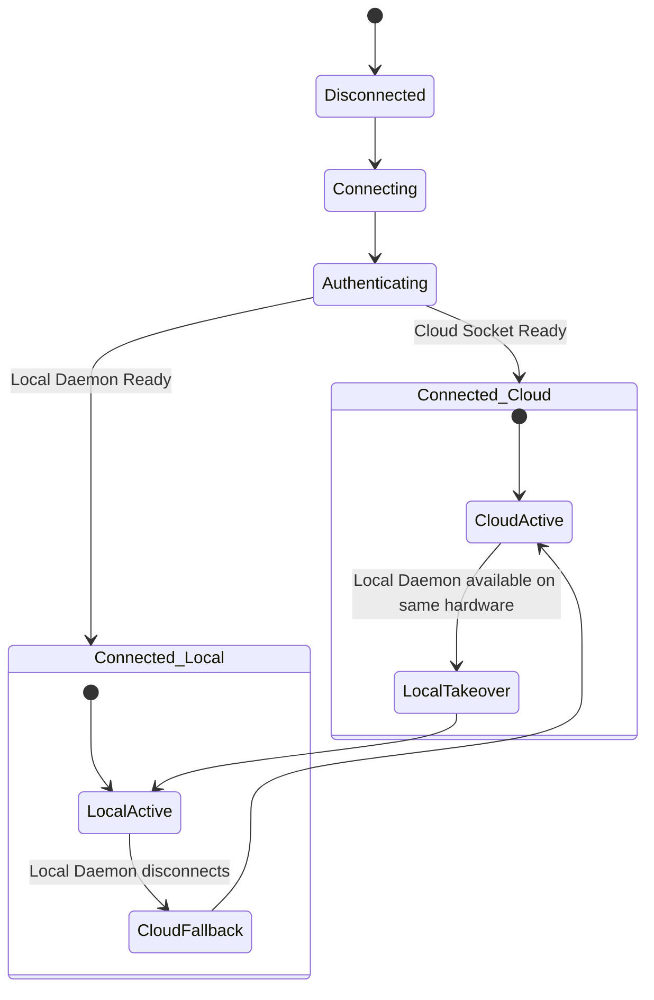
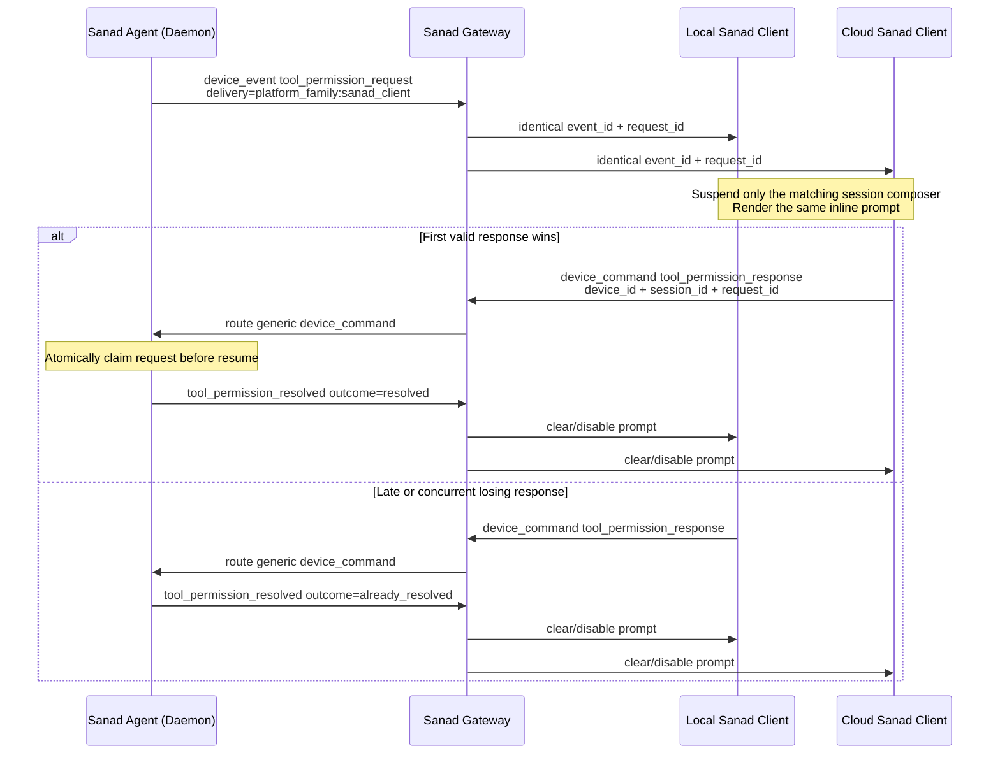

# بروتوكولات الاتصال ونظام نقل الأحداث | Communication Protocols & Event Flow Spec

This document details the communication layers, event schemas, connection models, and interactive flows (queuing, steering, and suspensions) within the Sanad Agent platform.

---

## 1. System Communication Architecture & Routing Paths

Sanad supports two separate routes for client-to-agent communication to balance performance, privacy, and remote accessibility:

1. **Direct Local Route (اتصال محلي مباشر):** Bypasses the cloud gateway entirely. The UI client connects directly to the configured local daemon URL, which defaults to `localhost:58085` and may be assigned per Git worktree during development. This ensures offline functionality, extreme low latency, and absolute privacy.
2. **Cloud Relayed Route (اتصال سحابي عبر البوابة):** Relays traffic through the public Sanad Gateway backend via Socket.IO. This enables control of remote headless servers or home devices from mobile/web interfaces.

```text
  ┌────────────────────────────────────────────────────────────────────────┐
  │                               Sanad Client                              │
  │                             (Flutter UI App)                           │
  └───────────────────┬──────────────────────────────────┬─────────────────┘
                      │                                  │
                      │ 1. Direct Local Route            │ 2. Cloud Relayed Route
                      │ (Local WebSockets / Port 58085)  │ (Socket.IO / Port 8000/8001)
                      ▼                                  ▼
  ┌────────────────────────┐                    ┌────────────────────────┐
  │       Sanad Agent       │                    │      Sanad Gateway      │
  │     (Local Daemon)     │                    │    (FastAPI Backend)   │
  └────────────────────────┘                    └───────────┬────────────┘
                                                            │
                                                            │ Relay Socket.IO Stream
                                                            ▼
                                                ┌────────────────────────┐
                                                │       Sanad Agent       │
                                                │    (Remote Daemon)     │
                                                └────────────────────────┘
```

---

## 2. Socket.IO Event Schema

All events are formatted in JSON and routed via FastAPI's Socket.IO manager.

### 2.1. Client ↔ Backend (Gateway)

#### A. Device Discovery
- **Event: `get_devices` (Client → Backend)**
  - Sent by the client to discover available devices.
  - Payload: `null`
- **Event: `devices_response` (Backend → Client)**
  - Emitted by the backend containing the current device list.
  - **Important:** Never use the legacy `agents_response` event name.
  - **Security:** Ordinary device list responses must not include device pairing tokens.

#### A.1. Device Pairing Token Lifecycle
- **Event: `create_device` (Client → Backend)**
  - Creates a remote/headless device record and returns the plaintext pairing token once in `device_created`.
  - The backend stores only a hash of the token.
  - The token is initial pairing authority, not the durable daemon credential.
- **Event: `rotate_device_token` (Client → Backend)**
  - Replaces the current device credential with a new initial pairing token and returns it once in `device_token_rotated`.
  - The previous token is invalid after rotation.
- **Event: `delete_device` (Client → Backend)**
  - Deactivates the device and revokes its current credential.

#### B. Command Execution
- **Event: `device_command` (Client → Backend)**
  - Transmits commands (e.g. `think`, `stop`, `clear_history`) to the target daemon.
  - Payload Schema:
    ```json
    {
      "device_id": "uuid",
      "command": "think",
      "payload": {
        "message": "User query text here",
        "session_id": "uuid",
        "delivery_intent": "auto"
      }
    }
    ```
  - **Note:** Supported commands include `think`, `stop`, `clear_history`, `register_tools`, `workspace.get_policy`, `workspace.set_permission_mode`, `session.runtime_retry`, `session.runtime_continue_with_provider`, `tool_permission_response`, `session.pending_steer_cancel`, `session.queued_message_delete`, `session.stop_recovery_claim`, `session.stop_recovery_ack`, `device.update.check`, `device.update.apply`, and `device.runtime.restart`. Conversation actions sent by Sanad Client never use a direct `protocol_event`; local and cloud routes use this same explicit-device command envelope.
  - Every routed command has a canonical `request_id`. The gateway records a
    short-lived private route from that identifier to the originating app
    socket before dispatching the command. It does not broadcast a generic
    `device_command_echo` to the user's other interfaces.
  - The hosted Gateway relays a command only when the authenticated app User
    matches the live daemon connection for that `device_id`. Relayed payloads
    are not stored as hosted settings. Task 82 remote update, restart,
    workspace, and MCP commands follow
    [Remote Device Control Threat Model](remote_device_control_threat_model.md).

#### B.1. Workspace Policy Commands (Plan 25)
- **Command: `workspace.get_policy`**
  - Requests the active permission policy for a workspace path.
  - Payload Schema:
    ```json
    {
      "workspace_path": "/absolute/path/to/workspace"
    }
    ```
  - Response Schema:
    ```json
    {
      "permissionMode": "default" | "full_access"
    }
    ```

- **Command: `workspace.set_permission_mode`**
  - Sets/updates the permission mode of a daemon-registered workspace. The
    daemon resolves the current path from `workspace_id`; a legacy
    `workspace_path` field may be sent for client compatibility but is ignored.
    Both local and cloud clients may explicitly select `default` or
    `full_access`. `think` and `steer` never change this policy implicitly.
  - Payload Schema:
    ```json
    {
      "workspace_id": "workspace-id",
      "permission_mode": "default" | "full_access"
    }
    ```
  - Response Schema:
    ```json
    {
      "permissionMode": "default" | "full_access"
    }
    ```

#### C. Reverse Tool Result
- **Event: `tool_result` (Client → Backend)**
  - Dispatches execution output of client-side tools back to the backend.
  - Payload Schema:
    ```json
    {
      "run_id": "uuid",
      "result": "Output payload string"
    }
    ```

---

### 2.2. Backend ↔ Daemon (Bridge Events)

#### A. Registration
- **Event: `register_device` (Daemon → Backend)**
  - Registers the running local agent with the Gateway.
  - Payload contains the system's unique `hardware_id` (obtained from `auth.json`).
  - First pairing sends `pairing_token` plus an agent-generated and
    pre-persisted `proposed_device_token`. The Gateway atomically binds
    `hardware_id`, replaces the pairing-token hash, and rejects later replay.
  - A normal reconnect sends only `device_token`. If the first
    `register_success` was lost, retrying the original pair is idempotent
    because the Gateway can authenticate the already-installed proposed token.
- **Events: `register_success` / `register_failed` (Backend → Daemon)**
  - Confirms the connection and maps the connection session to a canonical `device_id`.
  - `register_success` never returns a plaintext device credential. The daemon
    promotes its pre-persisted proposed token and removes the initial pairing
    token only after this event.

#### B. Device Capabilities
- **Event: `get_capabilities` (Client → Backend)**
  - Queries target device specs.
- **Event: `capabilities` (Backend → Client)**
  - Returns device capabilities (e.g. supported plugins, tools, file browsing).
  - Must remain safe on first run with zero configured providers or zero legacy data. This event is not allowed to depend on default-provider resolution or live LLM adapter creation.
  - Provider model catalogs are not part of `capabilities`; they are queried through provider-runtime commands such as `model.snapshot` and `model.refresh`.
  - **Note:** Capabilities are tied to `device_id` (not `device_type`) in Redis and envelopes.

#### C. Event Stream Forwarding
- **Event: `device_event` (Daemon → Backend → Client)**
  - Streams thought outputs, status updates, or tool execution requests.
  - Payload Schema:
    ```json
    {
      "device_id": "uuid",
      "type": "event",
      "event": "thought_stream",
      "payload": {
        "session_id": "uuid",
        "content": "Continuing to search..."
      }
    }
    ```
  - Supported sub-event names (`payload.event` or `event` type):
    - `user_message`: Acknowledges incoming message.
    - `step_start`: Begins processing a turn.
    - `thought_stream` / `thought`: Real-time thought tokens.
    - `tool_use`: Details of the tool being called.
    - `execute_tool`: Requests local agent command line / browser execution.
    - `tool_result`: The output of a tool run.
    - `final_answer`: The final response text.
    - `session_title`: Updates the session's chat title.
    - `workspace.policy_changed`: Emitted when a workspace permission policy changes (payload: `{ "workspace_id": "id", "permissionMode": "default" | "full_access" }`).
    - `error`: Signals a daemon processing failure.

The gateway accepts `device_event` only from a connection authenticated as a
daemon. An app connection cannot inject events into this path. Delivery follows
an explicit policy:

- Explicit cross-interface state events use the user room regardless of request
  correlation so every interface refreshes its shared inventory.
- Other events matching a registered `request_id` return only to the requesting
  app socket.
- Live conversation events (`user_message`, thought/tool streams,
  `final_answer`, suspension, stop, and error events) broadcast to every app
  interface owned by the user. Each event retains `device_id` and `session_id`,
  allowing clients to update background session state without rendering it in
  the currently selected conversation.
- Only explicitly allowlisted cross-interface state events, such as session
  inventory changes and workspace policy changes, broadcast to
  `user_app_{user_id}`.
- A correlated event with an expired or missing origin is dropped rather than
  broadcast, preventing a private response from leaking to another interface.

Private snapshot responses still use `request_id` and return only to their
requesting socket. Receiving live events for another session must update that
session's processing and notification state, while the client presentation
continues rendering messages only for its selected session.

### Authoritative Session Execution State (Plan 31)

The daemon publishes `session.execution_state_changed` only after the durable
work-item mutation and execution-snapshot recomputation have committed. The
payload is the complete authoritative snapshot:

```json
{
  "session_id": "session-id",
  "state": "queued|running|waiting|blocked|resuming|stopping|idle",
  "work_item_id": "nullable-work-item-id",
  "request_id": "nullable-request-id",
  "revision": 4,
  "updated_at": "2026-07-15T12:00:00.000Z",
  "turn_started_at": "2026-07-15T11:58:35.000Z",
  "elapsed_ms": 85000
}
```

`turn_started_at` is the stable accepted-work timestamp for the representative
work item and survives queued, running, waiting, blocked, resuming, and stopping
transitions. `elapsed_ms` is an observation computed when the payload is
serialized. It lets a client anchor a local display ticker without comparing
the client clock to the daemon clock. Reopening or reconnecting receives a fresh
observation through the existing session query snapshot.

Actual changes to `(state, work_item_id, request_id, turn_started_at)` advance
the per-session revision once. An idempotent recomputation neither advances the
revision nor publishes another event. A later query may return a greater
`elapsed_ms` for the same revision; clients treat that value as a refreshed
observation, not conflicting execution authority. Delivery uses `platform_family=sanad_client`; the
runtime mints one `event_id` before GatewayManager fan-out, and local and cloud
copies retain that same identity and payload.

`session_history` always contains `execution_snapshot`. Every row in a
paginated `sessions_list` contains its own `execution_snapshot` as well. A
session with no persisted snapshot row is represented explicitly as
`idle/revision=0`, with null work/request identities and the Unix epoch as its
stable virtual timestamp. Missing terminal, in-flight, or runtime-notice
events must not be interpreted as evidence of idle state.

On daemon restart, execution snapshots are recomputed from restored durable
work. `running`, `waiting`, `blocked`, and safely normalized `resuming` work
remain non-idle; a process-local `stopping` projection is discarded and
derived again from the durable work rows owned by the new process.

### Live context usage projection

Eligible `tool_use` and `final_answer` events may carry `context_usage`. The
projection represents one completed LLM invocation and uses canonical optional
fields: `input_tokens`, `output_tokens`, `total_tokens`, `cached_tokens`,
`reasoning_tokens`, `context_window_tokens`, `model_id`,
`provider_instance_id`, `run_id`, `model_step_id`, and `observed_at`. Token
values are copied from the latest provider response after key normalization;
missing values are not inferred and values from multiple invocations are never
combined.

The daemon persists the latest projection per session and on the corresponding
assistant message. `session_history` returns it at payload level and on the
latest eligible reconstructed event. For legacy history without a projection,
the daemon derives one from the last assistant message carrying provider usage,
without accumulating earlier messages. `sessions_list` rows include the latest
projection when one is persisted. The client displays `cached_tokens` as
`Cached input` when present and never displays cache-write usage.

### `get_sessions` Pagination Contract (Plan 32a)

- `get_sessions` accepts optional `workspace_id`, `unscoped_only`, `limit`, and `cursor`.
- `workspace_id` and `unscoped_only=true` are mutually exclusive; invalid combinations must return a structured query error instead of silently falling back.
- `limit` is server-owned: missing uses the daemon default, invalid/non-positive values are rejected, and oversized values are capped centrally.
- Ordering is authoritative: `last_user_message_at DESC`, then `session_id DESC`.
- After session creation, only canonical user acceptance updates `last_user_message_at`. Fork creation initializes the child at its commit time so it appears first; assistant/tool/system events must not reorder the session list.
- Session/workspace/provider/model updates must preserve the stored `last_user_message_at`; only a newly accepted canonical user message may advance it.
- The cursor is opaque to clients and encodes the normalized ordering pair (`last_user_message_at`, `session_id`).
- `sessions_list` responses that carry a `request_id` are request-scoped snapshots. Clients must not treat filtered/paginated responses as the shared default sidebar stream automatically.
- During reconnect, stale cached sessions may stay visible temporarily, but the first authoritative daemon response must replace the visible snapshot rather than merge cached rows into it.
- Until Plan 32b converts the legacy sidebar consumer to explicit pagination, the compatibility path for `getSessions()` without a query may internally walk all daemon pages so older sessions remain reachable. New consumers must not depend on implicit get-all behavior.
- A `sessions_list` payload returns:
  - `sessions`
  - `has_more`
  - `next_cursor`
  - `execution_snapshot` inside every session row
  - per-session workspace metadata (`workspace_id`, `workspace_name`, `workspace_path`) when available
- `get_session_history` always returns `execution_snapshot`, while still omitting `runtime_notice`, `metadata`, and `request_id` keys when absent. A durable-only blocked notice may be surfaced lazily from persisted recovery state; a durable-only waiting notice must remain hidden until the runtime activates it.
- Canonical `tool_use` events place their body only in `input`, and canonical `tool_result` events place their body only in `output`. This applies to live events and reconstructed history on both transports. The client mapper consumes those structured fields; duplicating either body in `content` unnecessarily inflates payloads.
- Route fields (`route_revision`, `route_updated_at`) and `provider_instance_id`/`model_provider` are **conditionally emitted** per session row (and in `get_session_history`): they appear together only when the session has a resolved `providerId`. A legacy session with no `provider_id` (e.g. created before routing existed) is returned without any route keys, so legacy clients never receive a partial route snapshot that would force the client to raise a `FormatException`.

---

## 3. Dual Connection Model & Scope Resolution

The Flutter client (`sanad-agent/client`) coexists with both connection paths to support hybrid execution:
1. **Cloud Gateway:** Connects to the public FastAPI Socket.IO gateway to manage remote or paired instances.
2. **Local Daemon:** Connects via a local WebSocket to `127.0.0.1:58085` to manage direct, local workspace tasks.



### 3.1. Connection Triggers & Modes of Operation

#### A. Agent-Side Cloud Connection Trigger
- The `sanad-agent` daemon will **never** attempt to dial the central `sanad-gateway` unless two conditions are met:
  1. `ENABLE_GATEWAY=true` is set in the daemon's `.env` configuration file.
  2. A valid local authentication token (`token` in `auth.json`) is present.
- If either condition is missing, the daemon operates exclusively in **Local-Only (Offline) Mode** on the host port, completely ignoring cloud relay and avoiding infinite reconnection loop issues.

#### B. Desktop Local Authentication Exchange
- When the native Flutter client and Sanad Agent daemon run under the same Sanad Home:
  - Both derive authentication from the owner-only `auth.json` shared-document contract.
  - After login, refresh, pairing, or logout, the writer sends only `{"type":"authentication_exchange"}` through the authenticated Local Gateway.
  - The receiver reloads the file and updates memory plus cloud connection state. The event carries no credentials and cannot assert authentication state.
  - Web and mobile remain cloud-only and never participate in this exchange.

#### C. Headless Remote pairing
- For remote servers running in headless mode:
  - The user creates the device in Sanad Client and runs its generated
    one-command installer.
  - The installer saves the initial pairing token and starts the service.
  - The daemon generates the durable credential locally, and the Gateway
    consumes the initial token while binding the daemon hardware identity.
  - The client observes the authoritative Online event and can then relay
    `device_command` payloads to the remote agent.

### 3.2. Device Connection Coordinator (`DeviceConnectionCoordinator`)
- Evaluates the active socket states and matches the user's `hardware_id`.
- Resolves the active `ConnectionScope` (`cloud` | `local`) for each target device.
- **Local Reachability Rule:** If the target device's `hardware_id` matches the local machine's fingerprint, the coordinator treats it as a local candidate. It upgrades the connection to the local daemon and bypasses cloud routing when the local socket is active.
- **Synthetic identity boundary:** `local-agent` is a stable client inventory/cache id only. The coordinator never uses that text to infer transport; a matching `hardware_id` plus live local socket state is required. Once transport is resolved, commands target the hardware identity locally and the durable account device identity in cloud, never the synthetic row id.
- **Transition continuity:** Swapping connection scopes does not destroy the active conversation session cache. UI-side chat histories persist in-memory to prevent screen blanks during reconnects or local takeovers.
- **Restart reconciliation:** When a conversation is already bound to the local daemon, a bounded grace period keeps that binding and its cached sessions visible while the daemon restarts. The first session snapshot after reconnect is merged with the retained snapshot, then the client requests history for the active session to recover final answers, queue state, and runtime notices emitted while disconnected. A missing session in this transitional snapshot is not deletion proof; explicit `session_deleted` or an explicit manual refresh owns removal.
- **History/live deduplication:** Reconnect hydration reconciles persisted history with events retained in memory by canonical `request_id`, then `run_id`/event identity. Legacy user rows without an identity use same-session text plus a bounded timestamp match. Running thinking chunks remain mergeable so newer streaming content is not discarded.
- **Provider readiness during reconnect:** transport failure or timeout is an indeterminate readiness result and cannot open provider onboarding. Only a successful readiness response from the selected connected device may assert that provider setup is required.

### 3.3. Client Device Inventory Modes

The Flutter client builds its visible device list from platform-specific inventory sources:

- **Desktop clients:** merge a local inventory source with the cloud inventory when the user is authenticated. The local source represents the current machine as `This device` and exists independently from Sanad Gateway login state.
- **Web and mobile clients:** use the cloud inventory only. They must not create a local placeholder, attempt localhost daemon discovery, or expose local-only runtime controls.
- **Hybrid desktop clients:** when a cloud device has the same `hardware_id` as the current machine and the local daemon is reachable, the UI keeps the stable local entry identity and applies the cloud display name and cloud metadata to it instead of switching the visible device id.
- **Canonical ordering:** desktop pins its synthetic or same-hardware merged `local-agent` row first, then orders every other device by `created_at` ascending. Web/mobile have no local row and are fully oldest-to-newest. The Client reapplies this ordering after initial fetch, `device_created`, updates/status changes, and local/cloud merging; equal timestamps use device id as a stable tie-breaker, while records without a creation timestamp follow timestamped records.

Logout clears only the cloud inventory. It must not remove the desktop local source while the local daemon remains reachable.

### 3.3.1. Device Inventory Rename

Device names are account-owned inventory metadata. The client sends `update_device` with the durable backend `device_id`, a trimmed non-empty `name` of at most 255 characters, and a UUID-backed `request_id`. The backend returns `device_updated` and echoes both `request_id` and `device_id` for success and error responses. A successful response includes the authoritative serialized device and is broadcast to the user's app room so every connected client refreshes its inventory projection.

The synthetic desktop id `local-agent` is never a valid mutation target. When the visible local entry is merged with its cloud record, the client sends the entry's `cloud_device_id`. A local-only entry has no durable rename target.

### 3.4. Cloud App Connection Identity

The gateway treats `(user_id, hardware_id)` as one logical app connection.
When a client reconnects and authenticates a replacement Socket.IO session,
the gateway disconnects an older app socket with the same identity before the
new socket joins `user_app_{user_id}`. This prevents stale cloud connections
from multiplying daemon events. Different hardware identities may remain
connected concurrently, but command responses remain isolated to their origin;
only explicitly shared state uses the user room.

---

## 4. Message Queuing & Steering Flow

To manage state conflicts without trusting a stale client projection, Sanad
implements daemon-authoritative delivery classification, a FIFO queue, and a
durable pending-steer lifecycle. The client sends intent; the daemon decides the
actual classification from the live execution owner at admission time.

### 4.1. Delivery intent and authoritative classification

- `delivery_intent = auto` is the default and the fallback for older clients that omit the
  field. Enter and the send button use this intent. If the session owns a
  steerable `running` or `resuming` `ActiveRun`, the daemon classifies the
  request as `pending_steer`. If that run has already ended, it starts a normal
  turn. A waiting, blocked, queued, or stopping session is never treated as a
  steerable runner.
- `delivery_intent = queue` is an explicit FIFO preference sent by Control+Enter or
  Command+Enter. It queues behind older non-terminal work, but starts a normal
  turn when no older work remains at admission time.
- The daemon returns a classification confirmation correlated by the original
  raw `request_id`. The client does not infer `think`, `queued`, or
  `pending_steer` from local processing flags and does not insert an optimistic
  timeline or queue entry.
- A raw request id is the one wire identity across admission, queue mutation,
  steer lifecycle, history, and recovery. A client display id such as
  `user_<request_id>` must never be sent back as protocol identity.

### 4.2. FIFO queue mutations

- A queued user echo carries `metadata.queued = true` and the original raw
  `request_id`; the dedicated queued-messages panel renders that authoritative
  projection.
- Normal FIFO promotion emits the same request without the queued marker. A
  user-requested promotion to steer atomically removes the still-queued work
  item and admits the same identity to the current `ActiveRun.agentRunner`. If
  the run ended first, the daemon promotes it to a normal turn instead. If Stop
  owns the session, the item remains queued for Stop recovery.
- Delete is daemon-authoritative. The request stays visible with action-local
  progress until the daemon confirms removal. A row that has become running,
  steering, completed, or already removed returns an explicit idempotent
  outcome and is never deleted optimistically.
- Queue changes and the authoritative execution snapshot are committed
  together. Repeated promote/delete commands for one request cannot execute or
  inject the text twice.

### 4.3. Pending-steer lifecycle

The daemon persists a pending steer before confirmation and publishes
`session.pending_steer_changed` with `session_id`, raw `request_id`, `run_id`,
`generation`, `state`, `revision`, `text`, and `received_at`. Revisions increase
only for real transitions and clients ignore older or duplicate revisions.

The lifecycle is monotonic:

```text
pending -> delivering -> delivered
pending -> cancelled
pending -> recovered
```

- `pending` appears as one user bubble in the timeline with the English label
  `Pending` and a `Delete pending message` action. It is not yet model history.
- Delivery first reserves `pending -> delivering` against the owning run and
  generation. Only after the steer is incorporated into the correct model
  history and that history is saved may the daemon publish `delivered`.
- `delivered` removes the badge and delete action from the same bubble; it does
  not create a second user event. Reconstructed history and the pending
  snapshot merge by raw request id.
- `session.pending_steer_cancel` carries the session and steer request ids plus
  its own command request id. The bubble remains visible with disabled progress
  until one authoritative result arrives: `cancelled`,
  `delivery_in_progress`, `already_delivered`, `already_cancelled`,
  `stale_owner`, or `not_found`.
- Cancellation and delivery reservation are one race with one winner. A
  cancelled steer never enters model context; a delivering or delivered steer
  never reports false deletion success.

### 4.4. Safe delivery and history reconstruction

If tools are running, delivery waits for the complete tool batch and appends
the established out-of-band steering marker to the last tool result before the
next model request. A late steer after the final tool boundary becomes a user
continuation and supersedes the pre-steer terminal assistant projection without
releasing the session owner. Persisted `steer_messages` metadata reconstructs
the chronology `tool_use/tool_result -> steer user_message -> post-steer
final_answer`; internal marker text is never exposed in visible tool output.

Reconnect/history hydration returns durable pending steers with their latest
revision alongside delivered history. A stale run or generation cannot deliver,
cancel, or resurrect a steer owned by a newer run.

### 4.5. Stop draft recovery

Stop establishes a barrier before awaiting stream cancellation. It captures
pending steers and queued work that existed before that barrier, orders pending
steers by receipt time followed by queued work in FIFO order, cancels those
inputs, and publishes a durable recovery outcome correlated to the Stop request
id. Inputs admitted after the barrier are outside that outcome.

The originating client prepends the recovered text to the existing draft once,
without auto-send or extra blank lines, persists the session draft first, and
then acknowledges the outcome. Until that acknowledgement, reconnect may fetch
the same durable outcome. The Stop request id makes replay idempotent across
local/cloud duplicate delivery. Other clients may observe authoritative queue
and pending-state changes, but must not copy the recovered text into their own
local drafts merely because they observed Stop.

The same `session.stop_draft_recovery` payload atomically retires captured UI
projections. Every item with `source = pending_steer` removes the matching
`user_<request_id>` bubble for that session before draft recovery is offered to
the owning client. This projection cleanup is transport-replay safe and blocks
late non-terminal lifecycle copies from resurrecting the recovered bubble;
composer mutation remains independently ownership-gated.

Before sending Stop, the initiating client persists a random
`recovery_owner_token` beside that session draft and includes it in the Stop
payload. The daemon stores it as the private owner but omits it—and omits
`claimed_by`—from every `user_stop` recovery payload. After the draft flush,
`session.stop_recovery_ack` must carry the same `recovery_owner_token`; the
public `stop_request_id` alone cannot acknowledge or clear the outcome.

A daemon restart has no surviving initiating socket, so recovered pending input
uses an explicit first-writer claim instead of exposing text to every client:

1. Startup reconciliation converts an unproven `pending` or `delivering` steer
   to a durable recovery outcome with `recovery_reason = daemon_restart` and
   `claim_required = true`. Its advertised payload contains `item_count` but an
   empty `items` array.
2. A client first persists a generated claim id in the matching session draft,
   then sends `session.stop_recovery_claim` with `session_id`,
   `stop_request_id`, and that id as `command_request_id`.
3. The daemon atomically assigns `claimed_by` only when the outcome is still
   unacknowledged and unclaimed. Only the winner receives
   `session.stop_draft_recovery` with the recovered `items`,
   `claim_required = false`, and `claimed_by` equal to its claim id. A repeated
   claim by the same id is idempotent; another id receives no text.
4. The winning client accepts the payload only when `claimed_by` matches its
   in-memory or persisted draft claim. It flushes the prepended draft and then
   sends `session.stop_recovery_ack` with that claim id as `claimant_id`.
   Acknowledgement timestamps the outcome and clears its stored `items` only
   when the claimant matches the durable winner.

`get_session_history` hydrates the latest unacknowledged outcome. Before a
restart claim succeeds it therefore exposes only the claim-required marker;
even after a claim, history never returns the protected text or claimant id.
Only the direct response to the winning connection contains them.

---

## 5. Runtime-Owned Suspension Flow (Permissions & Ask User)

When the agent requires confirmation or additional information, it suspends execution and requests user feedback.



### 5.1. Suspension Lifecycle
1. **Trigger:** The daemon emits one canonical `tool_permission_request` for either a permission decision or `system_ask_user`; all eligible copies preserve the same `event_id`, `request_id`, `session_id`, and payload.
2. **Delivery policy:** A run whose captured origin belongs to `sanad_client` uses `DeliveryPolicy.platformFamily(sanad_client)`. An external platform family remains `origin` scoped.
3. **UI interception:** Each Sanad Client updates the matching session attention store. Only the active matching session blocks its composer and renders the inline controls; background sessions update their sidebar state without replacing the open card.
4. **Response transport:** Permission decisions, denial comments, and ask-user answers use `device_command(command=tool_permission_response)` with explicit `device_id`, raw `request_id`, and `session_id`. The client does not clear the request optimistically.
5. **First-writer-wins:** The daemon removes an in-memory waiter before completing it. Restart-restored checkpoints use one conditional SQLite claim from `awaiting_permission` to `resuming` or `denied`, so only one response can resume or execute the tool.
6. **Authoritative clear:** After a successful claim the daemon emits `tool_permission_resolved` with `outcome=resolved`; a late response emits the same event with `outcome=already_resolved`. Sanad Client clears/disables the matching request only from this event or a later terminal lifecycle event.
7. **Hydration:** History exposes only unresolved checkpoints. A resolved checkpoint cannot be revived by reconnect or stale history.
8. **Restart classification:** An unresolved checkpoint covering every executing tool call restores the session as `waiting`, without an `Execution interrupted` notice or a synthetic cancelled tool result.
9. **Durable resume:** A restart-restored response claims the work item as `resuming`; terminal delivery occurs only after the original run/generation owner commits the item as `completed`.
10. **Notice reconciliation:** Startup removes runtime notices that have no active non-terminal work owner. A restoration exception never attaches recovery notices to completed or cancelled historical sessions.

## 6. Phase 27 — Unified Cross-Transport Event Delivery

### 6.1. Canonical Envelope
Every `device_event` carries a canonical delivery contract alongside the existing `device_id`/`hardware_id`/`session_id`:

```json
{
  "type": "device_event",
  "event_id": "evt_01J...",
  "event": "final_answer",
  "delivery": {
    "scope": "platform_family",
    "platform_family": "sanad_client",
    "request_id": null,
    "target_hardware_id": null
  },
  "origin": {
    "platform_family": "sanad_client",
    "transport": "local",
    "platform_instance_id": "local-daemon",
    "route_id": "opaque-origin-route"
  },
  "device_id": "canonical-device-id",
  "hardware_id": "daemon-hardware-id",
  "session_id": "session-id",
  "run_id": "run-id",
  "payload": {}
}
```

### 6.2. Delivery Scopes
- **`origin`** — returns to the originating platform instance/conversation only. Used for query/snapshot results, save confirmations, and pre-run errors. Requires `request_id` for cloud resolution; fail-closed when the route is missing.
- **`platform_family`** — fans out to every platform instance of the declared family. Only `sanad_client` is supported for multicast; it covers `LocalDaemonServerPlatform` (transport `local`) and `ServerSanadGatewayPlatform` (transport `cloud`). Telegram/WhatsApp/CLI are NOT included.
- **`hardware`** — targets the single platform instance owning `target_hardware_id` within the family. No fallback to family broadcast. Used for platform-tool execution on a qualified device.
- **`device`** — app→daemon direction when a canonical device target is required; daemon routing stays by `device_id`.

### 6.3. Platform Families & Isolation
`platform_family` is a typed, extensible value object, NOT a closed enum. Well-known families:
| Platform | `platform_family` | `transport` | Default reply policy |
|---|---|---|---|
| Local Sanad Client | `sanad_client` | `local` | by `delivery` |
| Cloud Sanad Client | `sanad_client` | `cloud` | by `delivery` |
| Telegram | `telegram` | `telegram_api` | `origin` |
| WhatsApp | `whatsapp` | `whatsapp_api` | `origin` |
| CLI/TUI | `cli` | `cli` | `origin` |

External families (`telegram`/`whatsapp`/`cli`) use `origin` delivery and never enter `sanad_client` synchronization, including for runtime suspension prompts. A `tool_permission_request` fans out only when the captured run origin belongs to `sanad_client`; local, cloud, web, and mobile Sanad Client transports are one logical platform family.

### 6.4. Event Identity & Deduplication
- `event_id` is minted once at event creation and preserved across all local/cloud copies. It is NOT regenerated per transport, NOT derived from content/timestamp alone, and NOT reused. Most producers use UUID-backed ids; durable lifecycle producers may use a deterministic opaque transition id when history must reconstruct the exact live identity. Compaction uses `context_compaction:<compaction_id>:<status>` while retaining one logical `compaction_id` for tile folding.
- The Flutter client currently applies a temporary mitigation that deduplicates by `event_id + transport` via a shared `EventDeduplicator` injected into both transports by `DeviceConnectionCoordinator`. This still blocks repeated deliveries on the same transport while allowing one cloud copy and one local copy of the same logical event.
- Incoming `device_event` debug logging happens after this check, so a dropped transport copy is not reported as a second applied event.
- The dedupe cache is bounded (LRU + age), in-memory only, independent of the durable conversation log, and cleared on full logout — NOT on a same-device transport switch.
- Events without `event_id` are still processed (backward compat) but producers are expected to stamp it.

### 6.5. Routing Responsibilities
| Layer | Responsibility |
|---|---|
| Runtime / Protocol producer | Creates the event, assigns `delivery.scope` + `event_id` |
| `GatewayManager` | Selects the destination family/transport by `delivery`, without a switch over event names or platform-id strings |
| Local platform | Resolves the scope to concrete sockets (origin socket, all sanad_client sockets, or hardware-matched sockets) and stamps each outgoing copy with the recipient socket's registered `device_id` |
| Cloud platform | Forwards the canonical envelope to Sanad Gateway; rewrites `device_id`/`hardware_id` from registration state |
| Backend | Validates the `delivery` envelope, rejects non-`sanad_client` families, and routes by scope (origin → request registry, platform_family → user room, hardware → matched app connections) WITHOUT inspecting the event `name` |
| Flutter client | Deduplicates by `event_id + transport` (temporary mitigation), routes by `device_id`/`session_id`, updates background session state without switching the open conversation |

### 6.6. Failure Handling
- **Cloud down:** local keeps receiving runtime events; cloud does not accumulate unbounded copies. On cloud return, history and durable state are re-hydrated; no live stream is replayed as new.
- **Local down:** cloud keeps working via `ServerSanadGatewayPlatform`; the client switches transport without changing device identity or conversation store.
- **Missing `event_id`/`delivery`:** the envelope is rejected (fail-closed); there is no legacy fallback path.
- **Origin route missing:** the private reply is dropped safely, never broadcast.
- **Hardware target offline:** the request fails back to the owner; no fallback to family broadcast and no multi-device execution.

### 6.7. Conversation segment lifecycle

Canonical conversation events carry ownership and presentation identities independently:

| Event | Ownership | Presentation identity |
|---|---|---|
| `thought`, assistant chunk, `final_answer` | `run_id` | `model_step_id` |
| `tool_use`, `tool_result` | `run_id` | `tool_call_id` |
| every canonical envelope | unchanged | opaque string `event_id` |

A model step begins before each LLM invocation. Deltas merge only within that step; a later invocation after a tool or steer creates a new step. Tool use/result merge only when their `tool_call_id` matches. A final answer replaces only the running projection for its own `model_step_id` and preserves earlier completed thoughts.

`tool_use` also carries the `model_step_id` that produced the call and closes that thought projection as completed. An active-run `stopped` event carries `run_id + model_step_id`; the client removes only that unfinished projection. Recovery-only Stop may omit `model_step_id` and must preserve every stored thought because it has no active model projection to cancel.

A cancelled `tool_result` is published only after its durable owner transaction
commits. Live delivery and `get_session_history` both expose the same
`tool_call_id`, `run_id`, `model_step_id`, `generation`, `revision`, `status`,
`reason`, `started_at`, `terminal_at`, and optional `cleanup_outcome`. Repeated
Stop or a late success/timeout cannot advance the revision or replace that
terminal. The event envelope keeps the session and opaque event identities;
the payload does not duplicate tool output in `content`.

For an active tool Stop, delivery order is the durable cancelled `tool_result`,
then `stopped`, then the final `session.execution_state_changed` snapshot for
`idle` or preserved newer queued work. Durable work cancellation commits before
`stopped`; only snapshot publication is deferred to preserve wire order.

`get_session_history` emits these same identities and ordering. Legacy rows without a model-step identity use deterministic message/segment order. Canonical history is consumed directly and is never converted through a legacy model that requires numeric IDs; route-transition UUIDs therefore remain valid.

Compaction history is causally anchored after the durable retained-tail end row
and before the first later canonical message. Its real lifecycle timestamps are
display metadata, not the merge key, because ordinary history rows may carry
synthetic timestamps. A terminal `completed` or `failed` transition is
immutable for its logical `compaction_id`. A completed transition may be
republished with the same deterministic `event_id` exactly once when
`provider_confirmed_request_tokens_after` becomes available; status, causal
position, ranges, estimate fields, and summary do not change. Payloads expose
`before_measurement_kind` and keep the confirmed after-value distinct from
`estimated_request_tokens_after`.
